# ATA & LTA Accounting Firm ERP
## User Guide & Operations Manual (Layman's Edition)
*A Simple, Step-by-Step Visual Guide for Everyday Office Work*

**Document Reference:** `DOC-MAN-ERP-2026-LAYMAN`  
**Companies Covered:** Alliance Tax & Accounting (ATA) and Ledger Tax & Accounting (LTA)  
**Target Audience:** All Staff Members, Accountants, Field Officers, Managers, and Firm Partners  
**Last Updated:** September 2026  

---

# Table of Contents
1. [Welcome to Your ERP System (The Big Picture)](#1-welcome-to-your-erp-system-the-big-picture)
   - 1.1 What is this system and why do we use it?
   - 1.2 Two Companies, One Simple Screen (ATA & LTA)
   - 1.3 How to Read Your Screen: The 4 View Modes
   - 1.4 Quick Tour of the Menu Bar
2. [Who Can Do What? (User Roles & Permissions in Plain English)](#2-who-can-do-what-user-roles--permissions-in-plain-english)
   - 2.1 The 6 Team Roles Made Simple
   - 2.2 "Your Clean Desk Policy": Why You Only See What's Assigned to You
   - 2.3 The "Second Pair of Eyes" Rule (Four-Eyes Approval)
   - 2.4 Master Permissions Summary Table
3. [Step-by-Step Daily Routine for Each Role](#3-step-by-step-daily-routine-for-each-role)
   - 3.1 Daily Routine: System Administrator (IT & Firm Management)
   - 3.2 Daily Routine: General Manager (Client Projects & Team Coordination)
   - 3.3 Daily Routine: Senior Accountant (Client Invoices, Payments & Expenses)
   - 3.4 Daily Routine: Operations Specialist (Field Work, Permits & Checklists)
   - 3.5 Daily Routine: Documentation Officer (Vault Custody & Couriers)
   - 3.6 Daily Routine: Human Resources Specialist (Team Hours & Workload)
4. [Step-by-Step Instructions for Everyday Actions (With Screenshots)](#4-step-by-step-instructions-for-everyday-actions-with-screenshots)
   - Action 1: Logging In & Showing Your Password
   - Action 2: Switching Between ATA and LTA (or Viewing Both)
   - Action 3: Reading Your Dashboard & Today's Deadlines
   - Action 4: Adding a New Client Company
   - Action 5: Starting a New Client Project (Work Request)
   - Action 6: Moving a Project through the 4 Progress Phases
   - Action 7: Adding a Task using a Pre-Made Template
   - Action 8: Managing Pre-Made Task Templates (Admin)
   - Action 9: Creating a Client Invoice with VAT & 2307 Withholding Tax
   - Action 10: Checking Overdue Client Bills (AR Aging Report)
   - Action 11: Setting Up Monthly Recurring Retainer Fees
   - Action 12: Filing an Office or Agency Expense (Disbursement)
   - Action 13: Storing and Finding Important Documents in the Vault (DMS)
   - Action 14: Sending Documents by Courier (Grab/LBC Transmittal)
   - Action 15: Reviewing and Approving Changes (The Four-Eyes Screen)
   - Action 16: Requesting Project Money or Billing from Field (Operations Requests)
   - Action 17: Adding or Updating Staff Accounts (Admin)
   - Action 18: Checking the Security Audit Trail (Admin)
   - Action 19: Reviewing Reports and Practice Performance
   - Action 20: How Operations Staff View Their Day (Staff Dashboard & Board)
5. [Help! What Do I Do If Something Goes Wrong? (Troubleshooting Made Simple)](#5-help-what-do-i-do-if-something-goes-wrong-troubleshooting-made-simple)
6. [Frequently Asked Questions (FAQ)](#6-frequently-asked-questions-faq)

---

# 1. Welcome to Your ERP System (The Big Picture)

## 1.1 What is this system and why do we use it?
Welcome to the **ATA & LTA ERP Platform**! Think of this system as our accounting firm's **central digital office**. 

In the past, accounting and legal compliance work required keeping track of dozens of Excel spreadsheets, chasing coworkers on chat apps for expense receipts, searching physical file cabinets for client certificates, and manually calculating taxes. 

This ERP system brings everything together into one easy-to-use web screen:
* **Client Files:** Every client's legal name, Tax ID (TIN), business registration, and contact persons are stored in one master directory.
* **Work Requests & Task Lists:** Every client engagement (like annual tax filings, business permits, or SEC updates) is tracked step-by-step from start to finish.
* **Billing & Official Receipts:** Invoices are created automatically with 12% VAT and BIR Form 2307 deductions, and payments are tracked so no client bills are forgotten.
* **Office Expenses & Cash Advances:** Whenever you need money to pay government filing fees at the BIR or SEC, you can request and receive approved cash vouchers right here.
* **Document Vault (DMS):** You always know exactly which cabinet or shelf holds original client certificates, and you can view scanned PDF copies in seconds.
* **Messenger & Courier Tracking:** Every document delivered to a client via Grab Express or LBC has a signed delivery receipt attached so papers never get lost.

---

## 1.2 Two Companies, One Simple Screen (ATA & LTA)
Our practice operates under two sister companies:
1. **Alliance Tax & Accounting (ATA):** Specializing in bookkeeping, financial statements, and corporate tax compliance.
2. **Ledger Tax & Accounting (LTA):** Specializing in business registrations, government permits, SEC compliance, and corporate legal advisory.

**You do NOT need two separate usernames or passwords!** If you work for both companies, you log in once. At the top of your screen, there is a company selector:
* Select **ATA** to work on ATA client accounts.
* Select **LTA** to work on LTA client accounts.
* If you are a General Manager or Partner, you can choose **ALL** to view a combined bird's-eye summary of both firms on one screen.

---

## 1.3 How to Read Your Screen: The 4 View Modes
Whenever you open a client profile, work request, or invoice, the system allows you to choose how the information displays so you can work comfortably:
1. **Side Peek (Slide-Out):** The form slides out smoothly from the right side of your screen. This is perfect when you want to look at a form while still reading the main list behind it.
2. **Center Peek (Pop-up Box):** The form appears centered on your screen like a focused window. Great for quick updates.
3. **Full Page:** The form expands across your entire monitor. Ideal when entering long invoices with many line items or reading lengthy document checklists.
4. **New Tab:** Opens the record in a fresh browser tab. Great if you use two monitors and want to compare two projects side-by-side.

> [!TIP]
> Click the small view-mode icon in the top-right corner of any form to pick your favorite layout. You can check *"Save as default"* and the system will remember your choice every time you log in!

---

## 1.4 Quick Tour of the Menu Bar
Along the top and left side of your screen, you will find our main working sections:
* 📊 **Dashboard:** Your morning homepage showing urgent filing deadlines, to-do lists, and quick action buttons.
* 👥 **Client List:** Master directory of all companies we handle, their tax numbers, contact persons, and retainer fees.
* 📋 **Operations:** Where all client projects live! View visual boards (Kanban) tracking projects from kickoff to completion.
* 💰 **Billing:** Where you create client invoices, record payments, and check who still owes money.
* 💳 **Disbursement:** Where you request and record money spent on government filing fees, travel, or office expenses.
* 📁 **DMS (Document Vault):** Where scanned copies of client certificates, permits, and tax returns are safely stored.
* 📦 **Transmittal:** Where you prepare official delivery letters and track couriers (LBC, Grab) delivering documents to clients.
* 📬 **My Requests / Operations Requests:** Where field staff can ask Accounting for project expense money or billing.
* ⚖️ **Pending Approvals:** The review room where Managers and Admins verify and approve changes before they become final.
* 📈 **Reports:** Executive charts showing monthly revenue, tax filing deadlines, and team productivity.
* 🛠️ **Admin:** Where managers and IT create employee accounts and review security history.

---

# 2. Who Can Do What? (User Roles & Permissions in Plain English)

## 2.1 The 6 Team Roles Made Simple

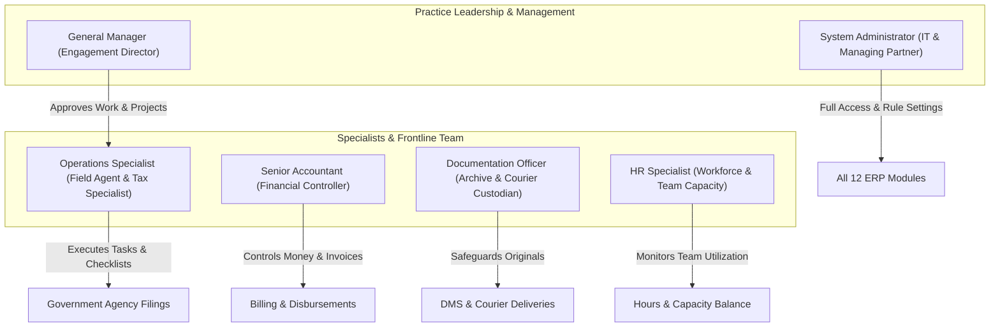
```mermaid
flowchart TD
    subgraph Leadership ["Practice Leadership & Management"]
        Admin["System Administrator (IT & Managing Partner)"]
        Manager["General Manager (Engagement Director)"]
    end
    
    subgraph Specialists ["Specialists & Frontline Team"]
        Acc["Senior Accountant (Financial Controller)"]
        Ops["Operations Specialist (Field Agent & Tax Specialist)"]
        Docs["Documentation Officer (Archive & Courier Custodian)"]
        HR["HR Specialist (Workforce & Team Capacity)"]
    end
    
    Admin -->|Full Access & Rule Settings| All[All 12 ERP Modules]
    Manager -->|Approves Work & Projects| Ops
    Acc -->|Controls Money & Invoices| Finance[Billing & Disbursements]
    Ops -->|Executes Tasks & Checklists| FieldWork[Government Agency Filings]
    Docs -->|Safeguards Originals| Vault[DMS & Courier Deliveries]
    HR -->|Monitors Team Utilization| Team[Hours & Capacity Balance]
```

### 1. System Administrator (`Admin`)
* **Who they are:** Managing Partner, IT Director, or System Controller.
* **What they do:** Can see and do everything. They set up employee accounts, choose which companies employees can access, configure pre-made task templates, and inspect security audit logs.

### 2. General Manager (`Manager`)
* **Who they are:** Engagement Director or Senior Account Manager.
* **What they do:** Oversees client projects. They create new Work Requests, assign tasks to staff, check completed work, and make sure government filing deadlines are met. They can request invoices from Accounting and approve staff tasks.

### 3. Senior Accountant (`Accounting`)
* **Who they are:** Accounting Manager or Financial Controller.
* **What they do:** Controls all firm finances. They are the only people who can officially create client sales invoices, calculate tax withholdings, record client payments, configure monthly retainer templates, and release cash disbursement vouchers.

### 4. Operations Specialist (`Operations`)
* **Who they are:** Tax Filing Agent, Field Liaison, or Compliance Specialist.
* **What they do:** The frontline engine! They visit the BIR, SEC, and City Halls, check off task checklists, upload photos of stamped government forms, log their travel hours, and request filing fee money from Accounting.

### 5. Documentation Officer (`Documentation`)
* **Who they are:** Archivist, Vault Custodian, or Logistics Coordinator.
* **What they do:** Takes care of physical binders and original client papers. When documents must be delivered to a client, they draft official transmittal letters, book couriers (Grab/LBC), and make sure signed delivery slips are uploaded.

### 6. Human Resources Specialist (`HR`)
* **Who they are:** People Operations Officer.
* **What they do:** Monitors employee workload so team members don't get overwhelmed with too many tasks due on the same day. They verify time logs and submit internal office supply requests.

---

## 2.2 "Your Clean Desk Policy": Why You Only See What's Assigned to You
Have you ever noticed that you only see certain projects on your screen? That is intentional! We call it the **"Clean Desk Policy"**:
* When an Operations Specialist logs in, they only see projects where they are assigned to a task or checklist item.
* Unrelated client legal disputes, private partner billings, or other teams' tax returns are hidden.
* **Why this helps you:** Your screen stays clean and organized, free of clutter, and sensitive client information remains strictly confidential.

---

## 2.3 The "Second Pair of Eyes" Rule (Four-Eyes Approval)
To prevent accidental mistakes and protect company funds, our ERP uses the **Four-Eyes Principle**:
* If a staff member creates a new project, asks for cash, or marks an invoice as paid, the system does not immediately finalize it.
* Instead, it places the request in the **Pending Approvals** room.
* A second person (a General Manager or Senior Accountant) reviews the request, checks the details, and clicks **Approve**.
* **Rule:** You can never approve your own request! A second pair of eyes is always required.

---

## 2.4 Master Permissions Summary Table

| Action | Admin | Manager | Accountant | Operations | Documentation | HR |
| :--- | :---: | :---: | :---: | :---: | :---: | :---: |
| **Switch between ATA & LTA** | ✅ | ✅ | ✅ | ✅ | ✅ | ✅ |
| **View Combined ('ALL') Summary** | ✅ | ✅ | ❌ | ❌ | ❌ | ❌ |
| **Create New Client Profile** | ✅ | ❌ | ❌ | ❌ | ❌ | ❌ |
| **Create New Work Request (Project)** | ✅ | ✅ | ❌ | ❌ | ❌ | ❌ |
| **Complete & Check Off Tasks** | ✅ | ✅ | ✅ | ✅ | ✅ | ✅ |
| **Approve Staff Tasks** | ✅ | ✅ | ❌ | ❌ | ❌ | ❌ |
| **Create Client Invoices** | ✅ | ❌ | ✅ | ❌ | ❌ | ❌ |
| **Request an Invoice from Accounting**| ❌ | ✅ | ❌ | ✅ | ❌ | ✅ |
| **Record Client Payment** | ✅ | ✅ | ✅ | ❌ | ❌ | ❌ |
| **File Expense / Cash Disbursement** | ✅ | ❌ | ✅ | ❌ | ❌ | ❌ |
| **Request Project Funds / Advance** | ❌ | ✅ | ❌ | ✅ | ❌ | ✅ |
| **Upload Document to Vault (DMS)** | ✅ | ✅ | ✅ | ✅ | ✅ | ✅ |
| **Create Courier Transmittal Letter** | ✅ | ❌ | ❌ | ❌ | ✅ | ❌ |
| **Approve Courier Dispatch** | ✅ | ❌ | ❌ | ❌ | ❌ | ❌ |
| **Add / Edit Employee Accounts** | ✅ | ❌ | ❌ | ❌ | ❌ | ❌ |
| **Inspect Security Audit Logs** | ✅ | ❌ | ❌ | ❌ | ❌ | ❌ |

---

# 3. Step-by-Step Daily Routine for Each Role

## 3.1 Daily Routine: System Administrator (IT & Firm Management)
1. **Morning Security Check:** Log in and open the **Pending Approvals** tab (`#admin/pending-approvals`). Review any special requests waiting for executive sign-off.
2. **Team Account Maintenance:** If a new employee joins the firm, open `#admin/users`, click **"+ Add User"**, set their email, choose their role and department, and assign ATA, LTA, or both. If someone leaves, set their status to **Inactive** immediately.
3. **Master Task Template Tuning:** In `#operations`, click the **Task Templates** tab. Ensure all standard service procedures (like "Quarterly BIR 2551Q Filing") have up-to-date checklist items and estimated minutes.

---

## 3.2 Daily Routine: General Manager (Client Projects & Team Coordination)
1. **Morning Cockpit Review:** Open the **Dashboard** (`#dashboard`). Check the **Urgent Deadlines** card to see which tax returns or permits are due in the next 48 hours.
2. **Launch New Client Work:** Click **"+ New Work Request"** to start an engagement. Choose the client, name the project, pick the filing deadline, and submit it.
3. **Assign Work to Team Members:** In the project detail view, click **"+ Add Task"**. Choose a pre-made template (so the checklist fills out automatically), select the Operations Specialist responsible, and assign the deadline.
4. **Approve Completed Steps:** When staff complete tasks or request invoice issuance, review their submissions and click **Approve**.

---

## 3.3 Daily Routine: Senior Accountant (Client Invoices, Payments & Expenses)
1. **Check Incoming Requests:** Click the **Operations Requests** badge. See if any field staff have requested billing for completed work or need filing fee advances.
2. **Issue Client Invoices:** Open `#billing` and click **"+ New Invoice"**. Select the client, type the service description, and let the system calculate the 12% VAT and BIR Form 2307 Withholding Tax. Click **Issue Invoice**.
3. **Record Payments:** When clients deposit funds into our bank account, click **Record Payment** on the invoice, type the deposit reference number, and print the official receipt voucher.
4. **Release Expense Funds:** In `#disbursement`, review approved cash advance requests. Enter the check number or online bank transfer code and mark the voucher as **Funded**.

---

## 3.4 Daily Routine: Operations Specialist (Field Work, Permits & Checklists)
1. **Check Today's To-Do List:** Log in and look at your **End-of-Day (EOD) Reminder** on the Dashboard. Click on any task to jump straight to the project.
2. **Filter the Board by "My Tasks":** In `#operations`, click the **"My Tasks"** button so you only see your own active cards.
3. **Work Through the Checklist:** Open your task card and move it from `Todo` to `In Progress`. As you complete each step (e.g. "Gather Sales Book", "Compute Percentage Tax", "Visit BIR RDO"), check off the box.
4. **Attach Government Receiving Stamps:** Take a photo or scan of the official BIR receiving stamp, click **Upload Attachment**, and save it to the task.
5. **Log Your Hours:** Click **Log Time**, type the hours spent and a brief note (e.g., "2.5 hours - Queued at BIR RDO 044 for tax clearance").

---

## 3.5 Daily Routine: Documentation Officer (Vault Custody & Couriers)
1. **Cataloging Received Documents:** When a client drops off corporate papers, open `#dms`, click **"+ Add Document"**, record the physical binder code (e.g., `Cabinet A, Binder LTA-04`), scan the PDF, and save it.
2. **Tracking Borrowed Papers:** If an Operations Specialist takes original SEC papers to a government agency, click **Handover Document** and record who borrowed it and when it must be returned.
3. **Preparing Courier Deliveries:** Open `#transmittal`, click **"+ Create Transmittal"**, select the client, choose which papers are in the pouch, and pick the courier (Grab/LBC).
4. **Closing the Delivery Loop:** When the courier returns with the client's signature, click **Mark Acknowledged** and upload a photo of the signed receipt slip.

---

## 3.6 Daily Routine: Human Resources Specialist (Team Hours & Workload)
1. **Review Team Utilization:** Check the **Capacity Heatmap** on the Dashboard. If one Operations Specialist has 50 hours of work this week while another has only 15, let the General Manager know so work can be rebalanced.
2. **Audit Daily Time Logs:** Check `#reports` to ensure all staff members are logging their hours daily so client billing remains accurate.

---

# 4. Step-by-Step Instructions for Everyday Actions (With Screenshots)

---

### Action 1: Logging In & Showing Your Password
* **Why you do this:** To safely access the system with your official company email.
* **What you see on screen:** A clean login box with an email address field, password field, and a small **Eye Icon**.

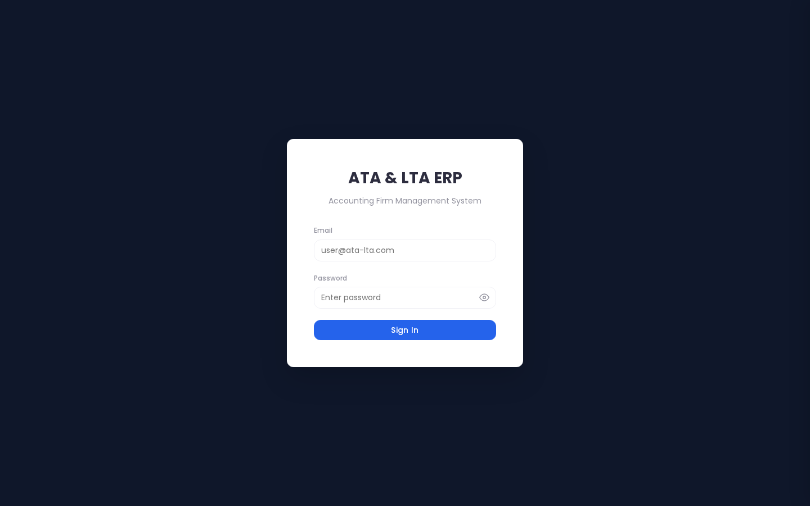

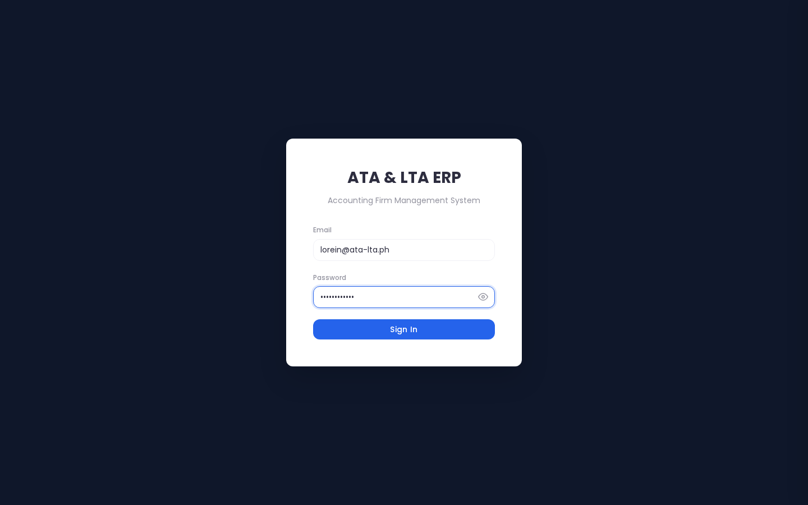

#### Step-by-Step:
1. Type your company email address (e.g. `lorein@ata-lta.ph`) in the **Email** box.
2. Type your password in the **Password** box.
3. **Helpful Tip:** If you want to double-check that you typed your password correctly, click the **Eye Icon** on the right side of the password box to reveal the letters.
4. Click the blue **Sign In** button.

---

### Action 2: Switching Between ATA and LTA (or Viewing Both)
* **Why you do this:** To change your workspace between Alliance Tax & Accounting (ATA) and Ledger Tax & Accounting (LTA).
* **What you see on screen:** In the top navigation bar, right next to your profile photo, is the **Company Switcher Pill**.

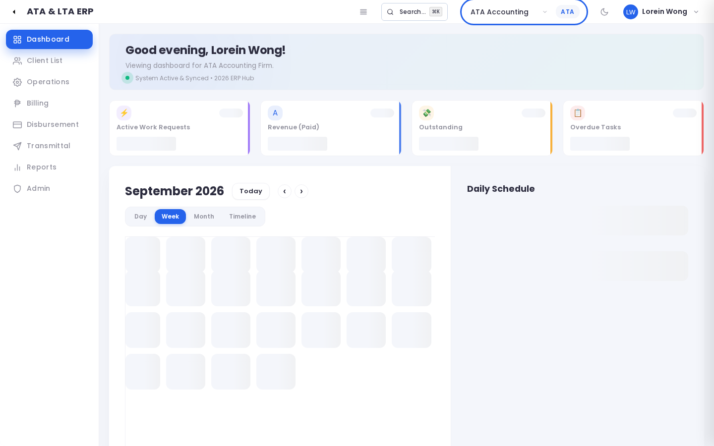

#### Step-by-Step:
1. Click on the company dropdown in the top header.
2. Click **ATA** if you are working on bookkeeping or tax returns for ATA clients.
3. Click **LTA** if you are working on corporate permits or SEC compliance for LTA clients.
4. If you are a Manager or Partner, click **ALL** to view consolidated totals across both firms.
5. The screen refreshes instantly with the selected company's files!

---

### Action 3: Reading Your Dashboard & Today's Deadlines
* **Why you do this:** To start your workday knowing your top priorities and urgent filing dates.
* **What you see on screen:** The Dashboard gives you a quick snapshot: Active Projects, Overdue Tasks, Invoices Waiting for Payment, and a Calendar of upcoming deadlines.

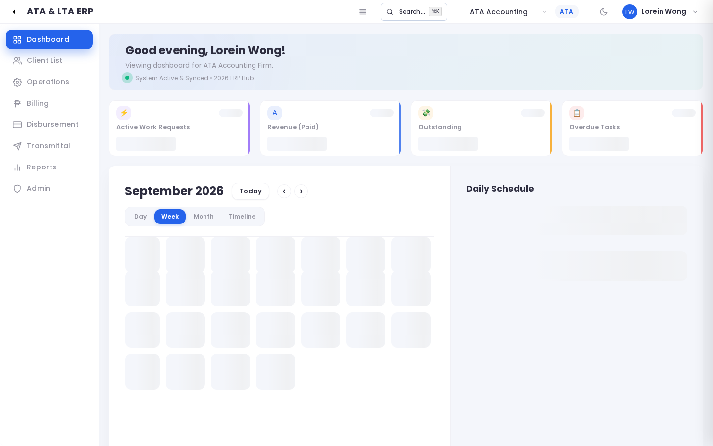

#### Step-by-Step:
1. Click **Dashboard** in the top navigation bar.
2. Look at the top colored metric cards to see high-level firm numbers.
3. Look at the **Urgent Deadlines** panel to see which government filings are due soonest.
4. Click on any deadline card to jump straight to that project!

---

### Action 4: Adding a New Client Company
* **Why you do this:** When a new client signs a service contract, their company profile must be added before work can begin.
* **What you see on screen:** The **Client List** shows all registered companies. Clicking **"+ Add Client"** slides out a form from the right side of your screen.

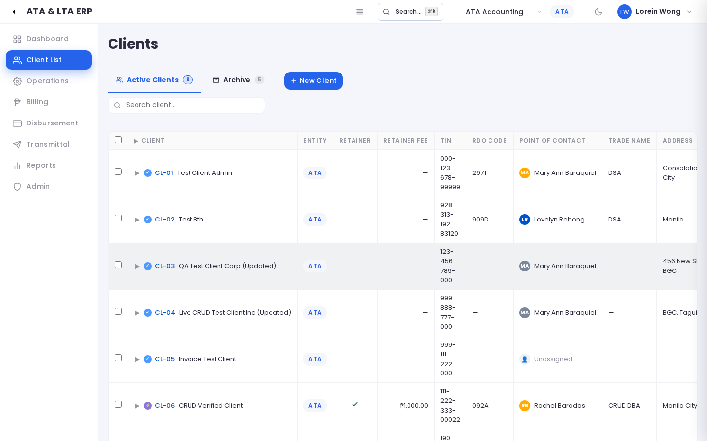

#### Step-by-Step:
1. Click **Client List** in the top menu bar (`#clients`).
2. Click the blue **"+ Add Client"** button in the upper-right corner.
3. In the form that slides out:
   - **Company Legal Name:** Type the registered corporate name (e.g. `Apex Pacific Trading Corp.`).
   - **TIN:** Enter the 12-digit Tax Identification Number (e.g. `123-456-789-000`).
   - **BIR RDO:** Select the Revenue District Office (e.g. `RDO 044 - Taguig`).
   - **Registration No.:** Enter the SEC or DTI registration number.
   - **Company Relationship:** Choose whether they hired **ATA**, **LTA**, or **Both**.
4. Scroll down to **Points of Contact** and enter the name, email, and mobile number of the client's finance head.
5. Enter the agreed **Monthly Retainer Fee** (e.g. `₱35,000.00`).
6. Click **Save Client**.

---

### Action 5: Starting a New Client Project (Work Request)
* **Why you do this:** To create a project container for a client engagement (e.g., Annual Income Tax Filing, Business Permit Renewal).
* **What you see on screen:** The **Operations** board shows projects organized in columns.

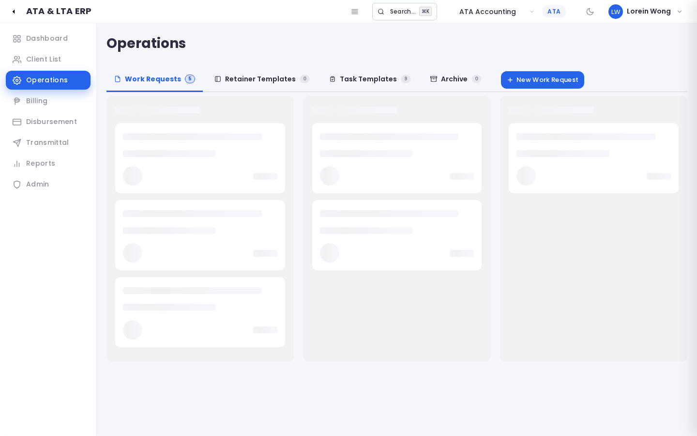

#### Step-by-Step:
1. Click **Operations** in the top menu (`#operations`).
2. Click the blue **"+ New Work Request"** button.
3. Select the **Client Name** from the searchable dropdown list.
4. Type a clear **Title** (e.g., *"2026 Annual Income Tax Return BIR 1702"*).
5. Select the **Priority Level** (`Normal`, `Medium`, `High`, or `Urgent`).
6. Set the **Target Completion Deadline** (the official statutory filing date).
7. Select the **Assigned Manager**.
8. Click **Submit Work Request**.

---

### Action 6: Moving a Project through the 4 Progress Phases
* **Why you do this:** Every professional project follows four clear stages: Gathering information, doing the work, filing with the government, and delivering final receipts.
* **What you see on screen:** Inside the project detail view, you will see a progress bar with 4 stages: **Discovery**, **Execution**, **Filing**, and **Closeout**.

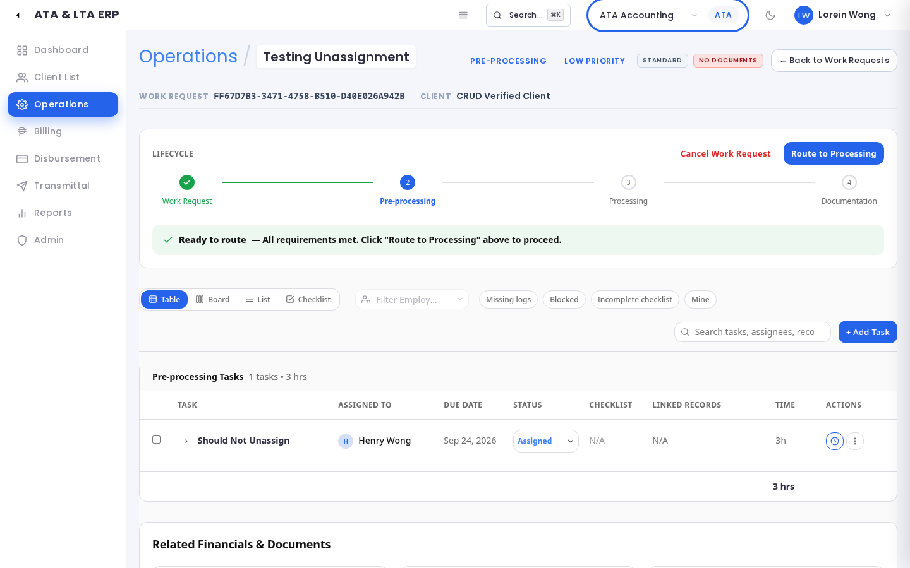

#### The 4 Phases Explained:
* 🔍 **1. Discovery:** Gathering client receipts, ledgers, and authorisations.
* ⚙️ **2. Execution:** Crunching the numbers, preparing tax returns, or drafting legal papers.
* 🏛️ **3. Filing:** Visiting the BIR, SEC, or City Hall to submit documents and secure stamps.
* 🏁 **4. Closeout:** Collecting payment, liquidating cash advances, delivering stamped originals by courier, and archiving the file.
* **How to advance:** When all tasks in a stage are completed, the General Manager clicks **Advance Phase** to unlock the next milestone!

---

### Action 7: Adding a Task using a Pre-Made Template
* **Why you do this:** To quickly add standardized steps to a project without typing the checklist by hand every time.
* **What you see on screen:** A pop-up box with a **Template Selector** dropdown.

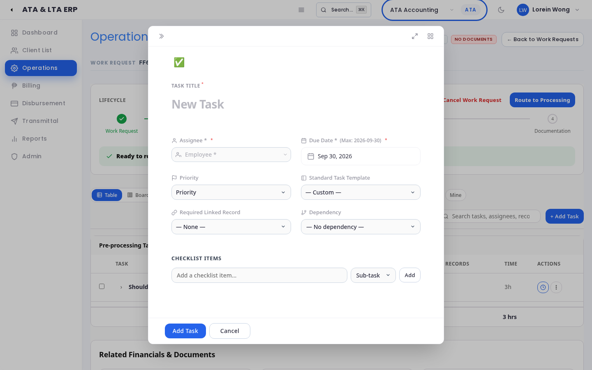

#### Step-by-Step:
1. Inside the project detail screen, click **"+ Add Task"**.
2. Click the **Select Template** dropdown and choose the service (e.g., *"Quarterly Percentage Tax Return 2551Q"*).
3. Notice how the system automatically fills in the title, default checklist steps, and recommended duration!
4. Choose the **Assigned Worker** (the person responsible for doing the work).
5. Set the **Task Due Date**.
6. Click **Save Task**.

---

### Action 8: Managing Pre-Made Task Templates (Admin)
* **Why you do this:** Administrators use this section to set up the firm's standard operating procedures so every employee follows the exact same quality checklist.
* **What you see on screen:** In `#operations`, the **Task Templates** tab lists all standardized firm procedures.

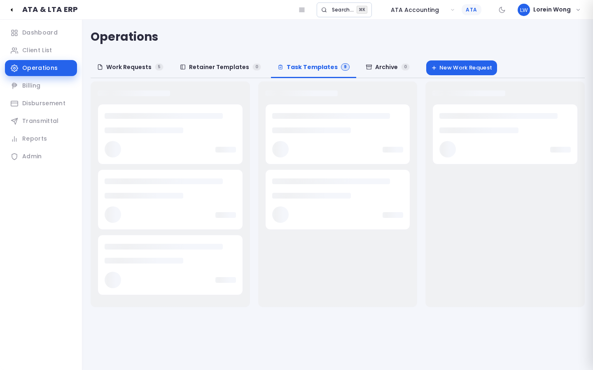

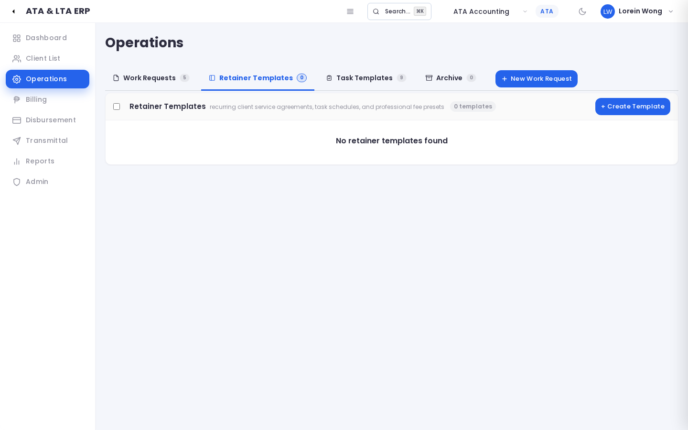

#### Step-by-Step:
1. Log in as an Administrator and go to `#operations`.
2. Click the **Task Templates** tab (visible only to Admins).
3. Click **"+ New Template"** to create a new procedure.
4. Type the **Template Title** (e.g. *"SEC General Information Sheet Annual Filing"*).
5. Add the checklist steps in sequential order with estimated duration in minutes.
6. Click **Save Template**. Now all staff can use this template when adding tasks!

---

### Action 9: Creating a Client Invoice with VAT & 2307 Withholding Tax
* **Why you do this:** To officially bill a client for retainer fees or project milestone achievements.
* **What you see on screen:** The **Billing** section lists all invoices. Clicking **"+ New Invoice"** opens the billing editor.

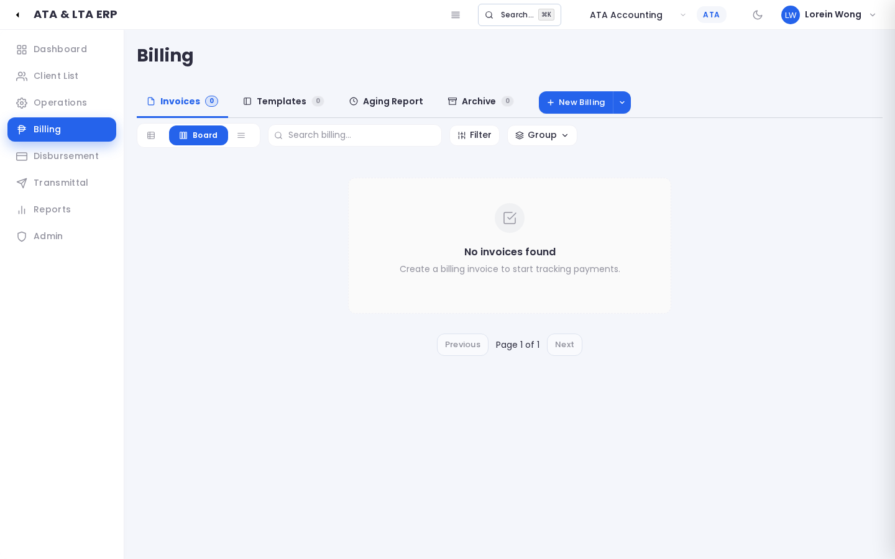

#### Step-by-Step:
1. Go to **Billing** (`#billing`) and click **"+ New Invoice"**.
2. Select the **Client Name**. The system assigns the next auto-incremented invoice number (e.g. `ATA-2026-0045`).
3. Link the invoice to the corresponding **Work Request Project** if applicable.
4. Under **Line Items**, type the service description, quantity, and unit price (e.g., *"Professional Tax Retainer - ₱40,000.00"*).
5. The system automatically calculates:
   - **Subtotal:** `₱40,000.00`
   - **12% VAT:** `₱4,800.00`
   - **Less 2% BIR 2307 Withholding:** `-₱800.00`
   - **Total Net Cash Due:** `₱44,000.00`
6. Click **Save Draft** to review, then click **Issue Invoice** to send it to the client!

---

### Action 10: Checking Overdue Client Payments (AR Aging)
* **Why you do this:** To see which clients have unpaid bills and how many days past due they are.
* **What you see on screen:** The **AR Aging** tab groups outstanding client balances into color-coded time buckets.

#### What the Columns Mean:
* 🟢 **Current (0–30 Days):** Fresh invoices sent recently; within standard payment terms.
* 🟡 **31–60 Days:** Slightly overdue; time for a friendly reminder email.
* 🟠 **61–90 Days:** Overdue; follow up with the client's finance director.
* 🔴 **Over 90 Days:** Severely overdue; hold off on releasing new government filings until payment is arranged.

---

### Action 11: Setting Up Monthly Recurring Retainer Fees
* **Why you do this:** For clients on regular monthly retainers, this feature drafts all monthly invoices with a single click at the start of each month!
* **What you see on screen:** The **Retainer Templates** tab lists active retainer contracts.

#### Step-by-Step:
1. In `#billing`, click the **Templates** tab.
2. Click **"+ Add Retainer Template"**.
3. Choose the Client, monthly retainer amount, and cutoff day (e.g., 25th of the month).
4. At the beginning of each billing month, click **"Generate Monthly Invoices"** to automatically create drafts for all retainer clients!

---

### Action 12: Filing an Office or Agency Expense (Disbursement)
* **Why you do this:** To record cash spent on government filing fees (BIR, SEC, City Hall), travel, courier postage, or vendor payments.
* **What you see on screen:** The **Disbursements** list displays all payment vouchers, categorized by payee and funding status.

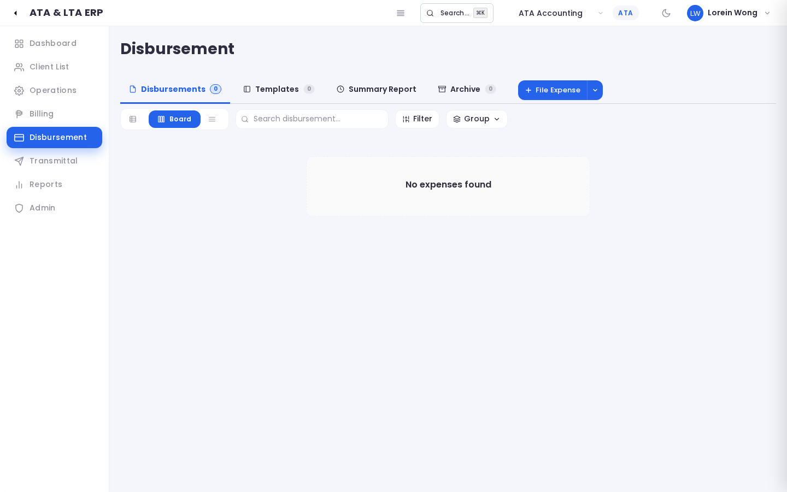

#### Step-by-Step:
1. Go to **Disbursement** (`#disbursement`) and click **"+ New Disbursement"**.
2. Select the **Payee Category** (`Government Agency`, `Third-Party Vendor`, or `Employee`).
3. Select the **Payee Name** (e.g. `Bureau of Internal Revenue`).
4. Link it to the active **Work Request** and **Task**.
5. Enter the **Amount** and **Purpose** (e.g., `₱12,500.00 - SEC Annual GIS Registration Fee`).
6. Click **Submit Disbursement**. Accounting reviews and releases the funds.

---

### Action 13: Storing and Finding Important Documents in the Vault (DMS)
* **Why you do this:** To ensure original client papers (Articles of Incorporation, BIR Form 2303, Mayor's Permits) are safe and digitally searchable.
* **What you see on screen:** The **DMS** repository organizes files with client names, categories, and physical shelf/binder locations.

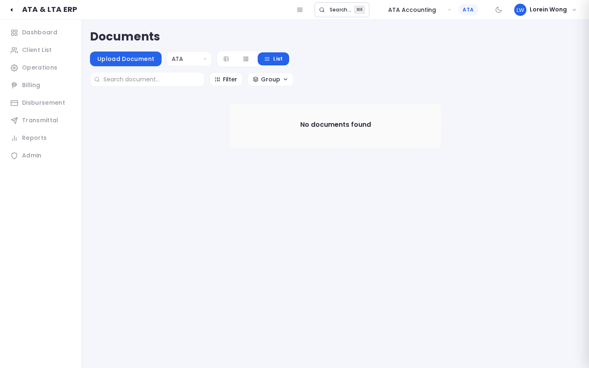

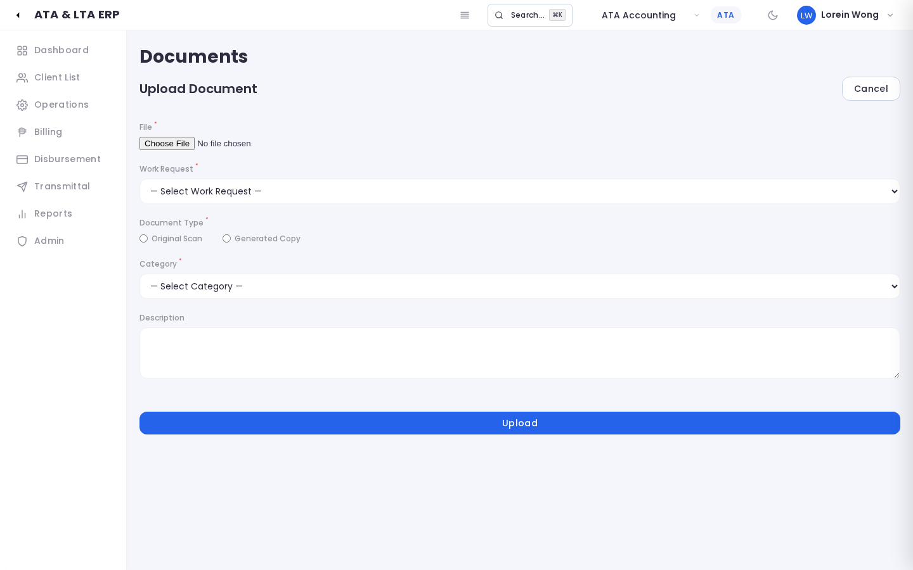

#### Step-by-Step:
1. Open **DMS** (`#dms`) and click **"+ Add Document"**.
2. Type the **Document Title** (e.g., *"Original BIR Certificate of Registration 2303"*).
3. Select the **Client Name** and **Category** (`Tax`, `Legal`, `Corporate`, or `Permits`).
4. Type the **Physical Binder Location** (e.g., `Vault 1, Shelf B, Binder LTA-CORP-012`).
5. Click **Choose File** to attach the scanned PDF.
6. Click **Upload Document**.

---

### Action 14: Creating a Courier Transmittal Letter
* **Why you do this:** When delivering official papers back to a client via messenger, Grab, or LBC, a Transmittal Letter provides proof of what was sent.
* **What you see on screen:** The **Transmittal** module lists all courier dispatches.

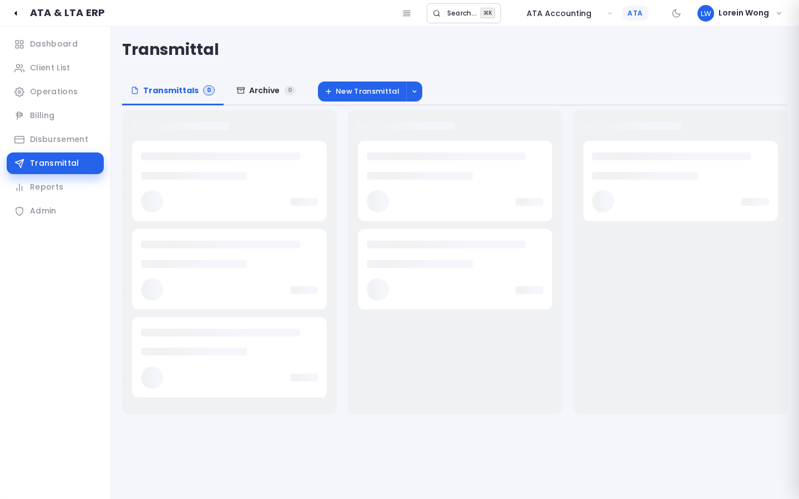

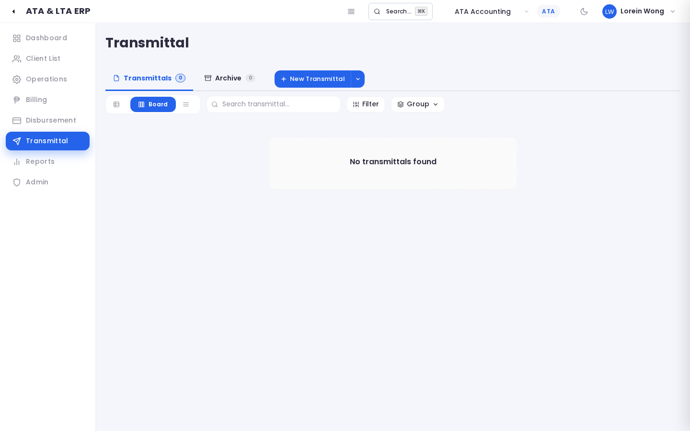

#### Step-by-Step:
1. Go to **Transmittal** (`#transmittal`) and click **"+ Create Transmittal"**.
2. Select the **Client** and recipient **Contact Person**.
3. Under **Items Included**, add the documents being sent (e.g., *"2025 Audited Financial Statements with BIR Stamp - 3 Original Copies"*).
4. Select the **Delivery Method** (`Grab Express`, `LBC Express`, or `Internal Messenger`).
5. Save the draft. Once approved by the Administrator, dispatch the courier and enter the **Tracking Number**.
6. When delivered, upload a photo of the client's signed acknowledgment slip to close the record!

---

### Action 15: Reviewing and Approving Changes (The Four-Eyes Screen)
* **Why you do this:** General Managers and Admins use this screen to double-check submissions before they affect live accounting records.
* **What you see on screen:** A clear, side-by-side comparison showing the **Current Database Value** on the left and the **Proposed Change** on the right.

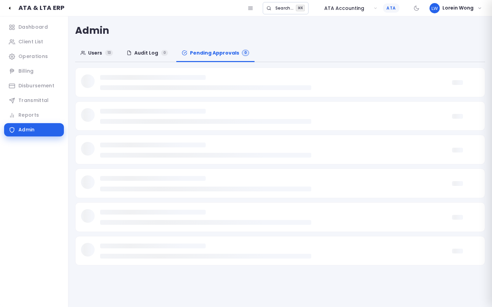

#### Step-by-Step:
1. Open `#admin/pending-approvals`.
2. Click **Review** next to any pending item.
3. Compare the old data on the left with the newly requested changes on the right (highlighted in color).
4. If everything looks correct, click the green **Approve** button.
5. If there is a mistake, click the red **Reject** button and type a brief explanation so the employee knows what to fix.

---

### Action 16: Requesting Project Money or Billing from Field (Operations Requests)
* **Why you do this:** When an Operations Specialist needs filing fees or wants Accounting to invoice a client, they submit a formal request ticket here.
* **What you see on screen:** The **Operations Requests** queue lists all inter-departmental tickets with their approval status.

#### Step-by-Step:
1. Inside any Work Request project, click **Request Disbursement** or **Request Invoice**.
2. Enter the amount needed and upload any agency assessment slip.
3. Submit the ticket. It appears under your **"My Requests"** tab.
4. Accounting will review the ticket, prepare the voucher, and notify you when the money is ready for pickup!

---

### Action 17: Adding or Updating Staff Accounts (Admin)
* **Why you do this:** When hiring new team members or changing an employee's role or company access.
* **What you see on screen:** The **User Management** screen lists all active and inactive employees.

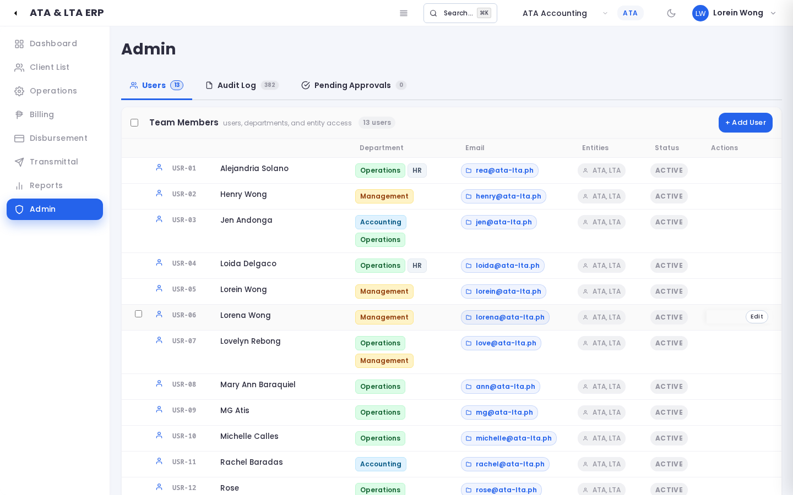

#### Step-by-Step:
1. Log in as Admin and go to `#admin/users`.
2. Click **"+ Add User"**.
3. Type the employee's Full Name and Company Email Address.
4. Select their **Primary Role** (`Admin`, `Manager`, `Accounting`, `Operations`, `Documentation`, `HR`).
5. Check their assigned **Departments** and **Companies** (ATA, LTA, or both).
6. Set a temporary password and click **Save User**.

---

### Action 18: Checking the Security Audit Trail (Admin)
* **Why you do this:** To see who made what change, when it was made, and from what computer.
* **What you see on screen:** An unalterable history log listing every click, invoice creation, and payment recording.

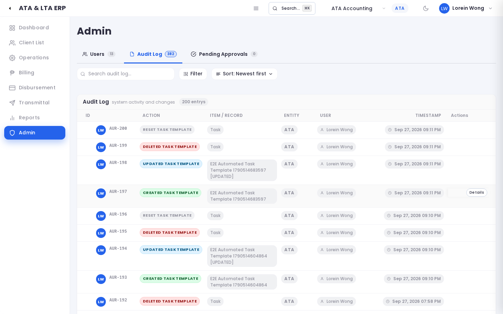

#### Step-by-Step:
1. Go to `#admin/audit`.
2. Filter by date, user email, or action.
3. Click the blue link in the **Item / Record** column to open the exact file that was touched!

---

### Action 19: Reviewing Reports and Practice Performance
* **Why you do this:** To see how many projects were completed this month, total collections, and average project turnaround time.
* **What you see on screen:** Professional charts and tables summarizing firm performance.

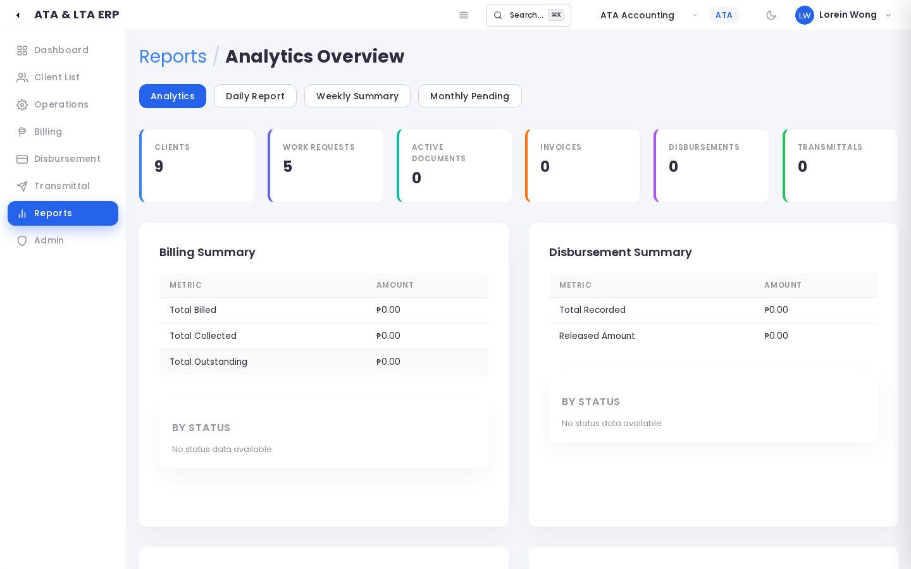

---

### Action 20: How Operations Staff View Their Day (Staff Dashboard & Board)
* **Why you do this:** Frontline staff enjoy a focused, simplified interface displaying only their own jobs.
* **What you see on screen:** A personalized Dashboard and Kanban board showing active assignments and daily checklists.

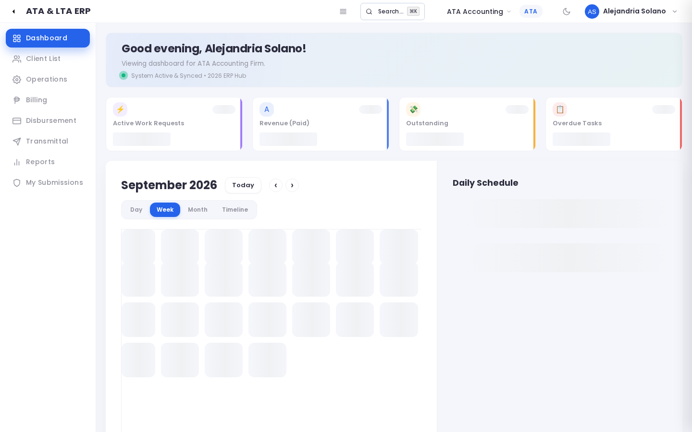

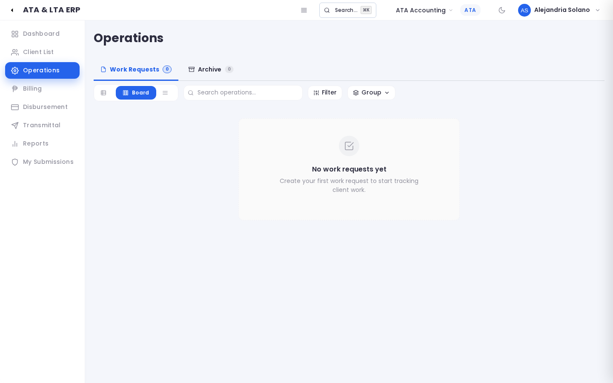

---

# 5. Help! What Do I Do If Something Goes Wrong? (Troubleshooting Made Simple)

### Q: It says "Too Many Requests" when I try to log in. What happened?
* **Plain English Explanation:** If you type the wrong password several times in a row, the system temporarily locks the door for 15 minutes to prevent hackers from guessing passwords.
* **How to Fix:** Wait 15 minutes. Use the **Eye Icon** on the password box to verify your spelling before clicking Sign In.

---

### Q: My screen looks frozen, shows old numbers, or won't show a new tab. What should I do?
* **Plain English Explanation:** Your web browser sometimes saves an old picture of the website to load faster.
* **How to Fix (The Clean Refresh):**
  - On a Windows computer: Hold down `Ctrl` and `Shift`, then tap `R` (or press `Ctrl` + `F5`).
  - On a Mac computer: Hold down `Cmd` and `Shift`, then tap `R`.
  - The screen will reload with the latest code immediately!

---

### Q: Why can't I see a Work Request or Invoice that my coworker just created?
* **Plain English Explanation:** Remember our **Clean Desk Policy**! If you are not assigned to a task on that project, the system hides it to keep your screen tidy and confidential.
* **How to Fix:** Ask the project manager to add you as a worker or co-assignee on one of the tasks. The project will appear on your board instantly!

---

### Q: Why can't I click the 'ALL' company button?
* **Plain English Explanation:** The combined 'ALL' view is an executive view reserved for General Managers and Firm Partners who manage both ATA and LTA.
* **How to Fix:** If you are an operational staff member, simply choose **ATA** or **LTA** directly in the top dropdown.

---

### Q: My file upload failed with "File Too Large". What should I do?
* **Plain English Explanation:** Each uploaded document cannot exceed 25 Megabytes (MB).
* **How to Fix:** If you scanned a document at ultra-high resolution, compress the PDF using standard office software before uploading.

---

### Q: I clicked "Print Voucher" or "Download Invoice", but nothing popped up!
* **Plain English Explanation:** Your web browser thinks the PDF is an unwanted advertisement and blocked it.
* **How to Fix:** Look at the right side of your browser address bar. You will see a small icon with a red X. Click it and select *"Always allow pop-ups from this website"*.

---

# 6. Frequently Asked Questions (FAQ)

### 1. Can a client be shared between ATA and LTA?
**Yes!** Many clients retain ATA for monthly bookkeeping and LTA for legal compliance or Mayor's Permit renewals. When creating the client, simply check both **ATA** and **LTA** under Company Affiliation.

### 2. Can I delete a task if I made a mistake?
If a task is still in `Draft` or `Todo`, you can edit or delete it. However, if a task is already `Completed` and linked to an official payment or transmittal, it is locked to maintain audit records.

### 3. What is the difference between an Operations Request and a Disbursement?
An **Operations Request** is you asking for something (like an internal memo saying *"Please give me ₱5,000 for BIR filing fees"*). A **Disbursement** is the actual accounting voucher and check issued by Accounting.

### 4. What happens if I make a typo on an issued invoice?
Issued invoices represent legal tax claims. If an invoice has a mistake, do not delete it. Contact Senior Accounting; they will cancel the invoice with a formal explanation and issue a corrected replacement.

### 5. Where do I find the physical binder of a client's documents?
Open **DMS** (`#dms`), locate the document title, and look at the **Physical Location** column. It shows the exact cabinet, shelf, and binder number in our archive room.

### 6. Who approves the courier transmittal before dispatch?
To ensure no original client documents are sent to the wrong address, the **System Administrator** must click **Approve Dispatch** before couriers are called.

---

*End of User Guide & Operations Manual (Layman's Edition) — Monorepo v0.1.0*
