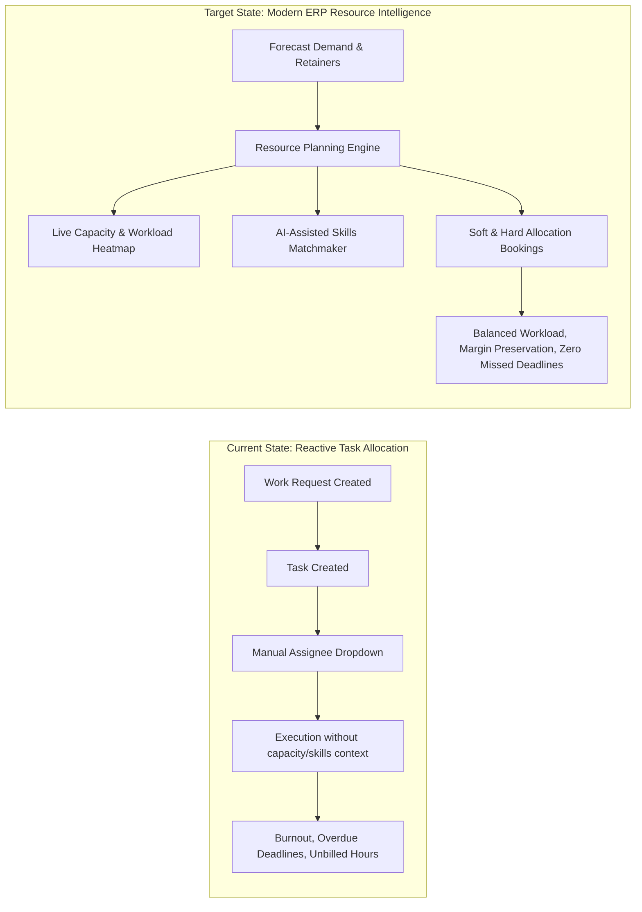
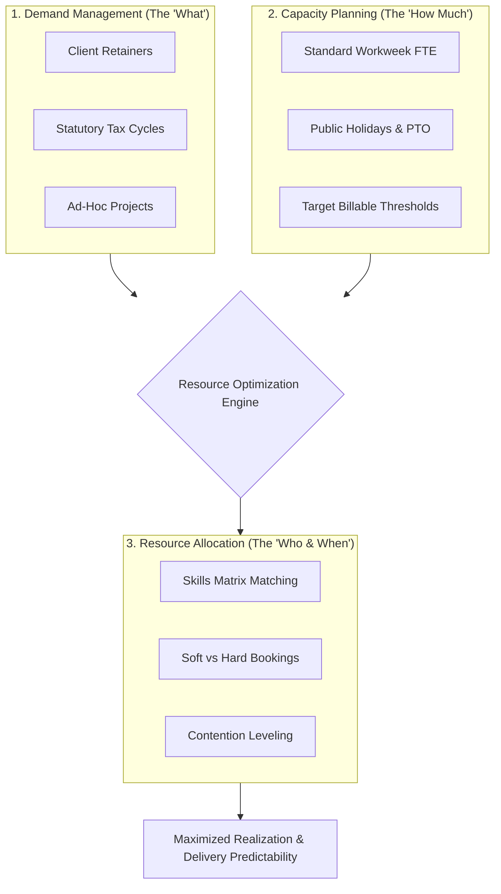
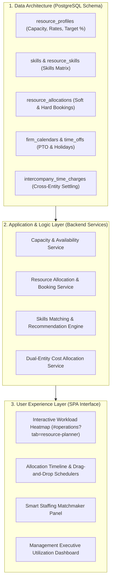
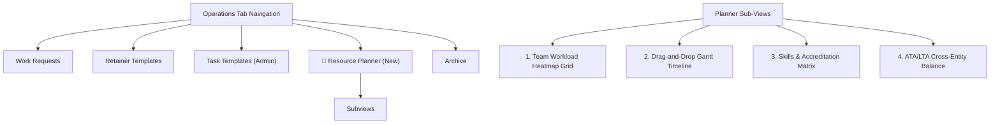

# Strategic Technical Specification: Resource Planning & Modern ERP Evolution

> **Project:** ATA & LTA Enterprise Resource Planning (ERP) Platform  
> **Document Identifier:** `DOC-ARCH-RESOURCE-PLANNING-2026-V1`  
> **Directory:** `/docs/RESOURCE_PLANNING_AND_MODERN_ERP_RECOMMENDATIONS.md`  
> **Status:** Recommendation & Architecture Specification  
> **Date:** September 2026  
> **Target Audience:** Systems Architects, Engineering Leads, Managing Partners  

---

## 1. Executive Summary & Problem Context

The **ATA & LTA ERP Platform** currently orchestrates client engagements, work requests, sub-resource tasks, billing, disbursements, and document custody across Alliance Tax & Accounting (ATA) and Ledger Tax & Accounting (LTA). 

While the platform excels at **transactional execution** (state machine routing, Kanban task cards, checklists, time logging, and two-phase approval gates), it currently lacks a dedicated **Resource Planning & Workforce Management Engine**. As the firms scale across multiple corporate entities and regulatory tax seasons, the absence of proactive capacity forecasting creates severe operational risks:



---

## 2. Current Project Gap Analysis

| Architectural Domain | Current Implementation in ATA-LTA ERP | Critical Enterprise Gap | Operational Risk |
| :--- | :--- | :--- | :--- |
| **Capacity Management** | Tasks have an `assigned_to` UUID and a `deadline` date. | No concept of weekly hours capacity (e.g. 40 hrs/wk), working calendars, or non-working holidays. | Staff members can be assigned 15 tasks due on the same day without warning. |
| **Demand Forecasting** | Retainer templates exist, but only auto-generate invoices. | Retainers do not reserve operational labor ahead of monthly tax filing cycles (e.g., BIR 2551Q, 1601C). | Severe quarterly resource bottlenecks and emergency overtime. |
| **Allocation Models** | Binary task assignment. Assigning a staff member immediately assigns the task. | No **Soft Booking** (tentative hold for proposal phase) vs **Hard Booking** (committed lock for active engagement). | Cannot plan staffing for prospective or pending work requests. |
| **Skills & Competency** | Simple role name (`Operations`, `Accounting`, `HR`). | No skills matrix (e.g., CPA licensure, BIR RDO accredited agent, SEC specialist, LGU liaison). | Work assigned to personnel lacking agency-specific jurisdiction expertise. |
| **Utilization & Margins** | Basic `task_time_logs` table (hours, date, notes). | Time is not compared against target billable utilization (e.g. 75% billable / 25% admin) or cost rates. | High revenue leakage; invisible non-billable overhead. |
| **Cross-Entity Sharing** | Users have `['ATA', 'LTA']` entity arrays, but tasks are isolated. | No cross-entity resource sharing with intercompany transfer pricing or utilization credit. | Staff working on LTA clients while on ATA payroll skew firm financial accounting. |
| **Visual Scheduling** | Kanban cards and tabular backlog lists only. | No interactive timeline, Gantt chart, or team workload heatmap. | Managers cannot visually spot who is swamped and who is on the bench. |

---

## 3. Industry Research & Theoretical Fundamentals

Modern leading Professional Services Automation (PSA) and Tier-1 ERP systems—including **SAP S/4HANA Cloud (Project Operations)**, **Oracle NetSuite OpenAir / SuiteProjects**, **Microsoft Dynamics 365 Project Operations**, **Workday PSA**, and **Certinia (FinancialForce)**—manage professional services through distinct, interconnected resource management disciplines.

### 3.1 The Three Pillars of Resource Management



#### 1. Demand Management
Forecasting required operational hours based on contracted client retainers, seasonal statutory compliance deadlines (e.g., Philippine BIR annual income tax returns in April, SEC General Information Sheets), and ad-hoc corporate registrations.

#### 2. Capacity Planning
Determining the firm's true net capacity. Gross hours (40 hours/week $\times$ staff count) are reduced by firm holidays, planned annual leaves, and operational administration to derive **Net Available Billable Capacity**.

#### 3. Resource Allocation & Contention Resolution
Assigning specific human capital to project milestones. When resource demand exceeds capacity (resource contention), modern ERPs apply:
- **Resource Leveling:** Shifting task start/finish dates within schedule float to avoid exceeding maximum capacity.
- **Resource Smoothing:** Reallocating non-critical sub-tasks to co-assignees or certified ground workers to maintain an even workload distribution.

---

### 3.2 Advanced PSA Paradigms: Connecting Time to Money

In professional accounting and tax advisory practices, human time is the primary billable inventory. Unlike manufacturing ERPs that track raw materials, a professional services ERP must seamlessly bridge **Time-to-Money**:

$$\text{Effective Hourly Rate (EHR)} = \frac{\text{Fixed Retainer Fee}}{\text{Actual Hours Spent}}$$
$$\text{Resource Utilization Rate} = \frac{\text{Billable Logged Hours}}{\text{Available Standard Capacity Hours}} \times 100$$
$$\text{Realization Rate} = \frac{\text{Invoiced & Collected Revenue}}{\text{Logged Hours} \times \text{Standard Billing Rate}} \times 100$$

When actual hours exceed planned capacity, the Effective Hourly Rate collapses, eroding gross margins. A formal resource planning system provides **real-time variance alerting** before margin erosion becomes irreversible.

---

### 3.3 Modern 2025/2026 ERP Architectural Benchmarks

Based on current architectural standards, modern ERP systems differ drastically from legacy monoliths:

1. **Composable & Event-Driven Architecture (EDA):** Modular Packaged Business Capabilities (PBCs) communicating asynchronously via event streams (e.g. `work_request.status_changed` triggers allocation recalculation).
2. **Interactive Real-Time Workload Heatmaps:** Live visual grids rendering individual worker utilization with color thresholds ($<70\%$ under-allocated / bench, $70\text{--}90\%$ optimal, $>100\%$ critical burnout).
3. **Agentic AI & Matchmaking:** Autonomous agents evaluating task requirements (e.g., BIR Form 1702 filing for an LTA client in Makati RDO) against employee skills, active licenses, calendar availability, and entity permissions.
4. **Universal Dual-Entity Shared Service Pool:** A unified talent registry that allows resources to execute work across multiple corporate entities with automated intercompany cross-charging ledgers.

---

## 4. Target Architecture for ATA & LTA ERP

To integrate these capabilities cleanly into the existing ATA-LTA monorepo (`/backend` Express API, `/erp_prototype` Vanilla JS SPA, PostgreSQL), we specify a **Four-Module Resource Planning Engine**:



---

## 5. Detailed Database Schema Specifications

### 5.1 `resource_profiles` (Workforce Capacity Master)
Extends the existing `users` table with professional capacity and financial costing parameters:

```sql
CREATE TABLE IF NOT EXISTS resource_profiles (
  id UUID PRIMARY KEY DEFAULT gen_random_uuid(),
  user_id UUID NOT NULL UNIQUE REFERENCES users(id) ON DELETE CASCADE,
  standard_weekly_capacity_hours NUMERIC(5,2) NOT NULL DEFAULT 40.00,
  target_billable_percentage NUMERIC(5,2) NOT NULL DEFAULT 75.00, -- 75% billable target
  cost_rate_hourly NUMERIC(10,2) NOT NULL DEFAULT 0.00, -- Internal wage/cost rate
  billing_rate_hourly NUMERIC(10,2) NOT NULL DEFAULT 0.00, -- Standard client bill rate
  primary_entity VARCHAR(10) NOT NULL CHECK (primary_entity IN ('ATA', 'LTA')),
  is_available_for_cross_entity BOOLEAN NOT NULL DEFAULT TRUE,
  created_at TIMESTAMPTZ NOT NULL DEFAULT NOW(),
  updated_at TIMESTAMPTZ NOT NULL DEFAULT NOW()
);

CREATE INDEX idx_resource_profiles_user ON resource_profiles(user_id);
```

### 5.2 `skills` & `resource_skills` (Skills & Competency Matrix)
Tracks statutory specializations, CPA licenses, agency accreditations, and jurisdictional experience:

```sql
CREATE TABLE IF NOT EXISTS skills (
  id UUID PRIMARY KEY DEFAULT gen_random_uuid(),
  name VARCHAR(100) NOT NULL UNIQUE,
  category VARCHAR(50) NOT NULL, -- 'Tax Compliance', 'Corporate Registration', 'Auditing', 'Field Liaison', 'LGU'
  description TEXT,
  requires_certification BOOLEAN NOT NULL DEFAULT FALSE,
  created_at TIMESTAMPTZ NOT NULL DEFAULT NOW()
);

CREATE TABLE IF NOT EXISTS resource_skills (
  id UUID PRIMARY KEY DEFAULT gen_random_uuid(),
  user_id UUID NOT NULL REFERENCES users(id) ON DELETE CASCADE,
  skill_id UUID NOT NULL REFERENCES skills(id) ON DELETE CASCADE,
  proficiency_level INT NOT NULL CHECK (proficiency_level BETWEEN 1 AND 5), -- 1: Novice, 3: Autonomous, 5: Expert
  certification_reference VARCHAR(100), -- e.g. PRC CPA #0142951 or BIR Accreditation #
  certification_expires_at DATE,
  verified_by UUID REFERENCES users(id),
  created_at TIMESTAMPTZ NOT NULL DEFAULT NOW(),
  UNIQUE(user_id, skill_id)
);

CREATE INDEX idx_resource_skills_lookup ON resource_skills(skill_id, proficiency_level);
```

### 5.3 `resource_allocations` (Soft & Hard Bookings)
Enables forward-looking time commitments decoupled from completed time logs:

```sql
CREATE TABLE IF NOT EXISTS resource_allocations (
  id UUID PRIMARY KEY DEFAULT gen_random_uuid(),
  work_request_id UUID REFERENCES work_requests(id) ON DELETE CASCADE,
  task_id UUID REFERENCES tasks(id) ON DELETE SET NULL,
  user_id UUID NOT NULL REFERENCES users(id) ON DELETE CASCADE,
  entity VARCHAR(10) NOT NULL CHECK (entity IN ('ATA', 'LTA')),
  booking_type VARCHAR(20) NOT NULL DEFAULT 'hard' CHECK (booking_type IN ('soft', 'hard')),
  status VARCHAR(20) NOT NULL DEFAULT 'confirmed' CHECK (status IN ('tentative', 'confirmed', 'completed', 'cancelled')),
  start_date DATE NOT NULL,
  end_date DATE NOT NULL,
  allocated_hours_per_day NUMERIC(4,2) NOT NULL DEFAULT 8.00,
  total_allocated_hours NUMERIC(6,2) NOT NULL,
  notes TEXT,
  created_by UUID REFERENCES users(id),
  created_at TIMESTAMPTZ NOT NULL DEFAULT NOW(),
  updated_at TIMESTAMPTZ NOT NULL DEFAULT NOW(),
  deleted_at TIMESTAMPTZ
);

CREATE INDEX idx_allocations_user_dates ON resource_allocations(user_id, start_date, end_date) WHERE deleted_at IS NULL;
CREATE INDEX idx_allocations_wr ON resource_allocations(work_request_id) WHERE deleted_at IS NULL;
```

### 5.4 `firm_calendars` & `resource_time_offs` (Net Capacity Constraints)

```sql
CREATE TABLE IF NOT EXISTS firm_calendars (
  id UUID PRIMARY KEY DEFAULT gen_random_uuid(),
  entity VARCHAR(10) NOT NULL CHECK (entity IN ('ATA', 'LTA', 'ALL')),
  calendar_date DATE NOT NULL,
  is_holiday BOOLEAN NOT NULL DEFAULT TRUE,
  holiday_name VARCHAR(100) NOT NULL,
  created_at TIMESTAMPTZ NOT NULL DEFAULT NOW(),
  UNIQUE(entity, calendar_date)
);

CREATE TABLE IF NOT EXISTS resource_time_offs (
  id UUID PRIMARY KEY DEFAULT gen_random_uuid(),
  user_id UUID NOT NULL REFERENCES users(id) ON DELETE CASCADE,
  leave_type VARCHAR(30) NOT NULL CHECK (leave_type IN ('Vacation', 'Sick', 'Official Business', 'Study/Exam')),
  start_date DATE NOT NULL,
  end_date DATE NOT NULL,
  status VARCHAR(20) NOT NULL DEFAULT 'approved' CHECK (status IN ('pending', 'approved', 'rejected')),
  created_at TIMESTAMPTZ NOT NULL DEFAULT NOW()
);
```

### 5.5 `intercompany_time_charges` (Dual-Entity Cross Charging)
Automates cross-entity settlement when an ATA employee executes tasks for an LTA client:

```sql
CREATE TABLE IF NOT EXISTS intercompany_time_charges (
  id UUID PRIMARY KEY DEFAULT gen_random_uuid(),
  time_log_id UUID NOT NULL REFERENCES task_time_logs(id) ON DELETE CASCADE,
  employee_id UUID NOT NULL REFERENCES users(id),
  home_entity VARCHAR(10) NOT NULL CHECK (home_entity IN ('ATA', 'LTA')),
  serving_entity VARCHAR(10) NOT NULL CHECK (serving_entity IN ('ATA', 'LTA')),
  work_request_id UUID NOT NULL REFERENCES work_requests(id),
  hours_logged NUMERIC(5,2) NOT NULL,
  transfer_cost_rate NUMERIC(10,2) NOT NULL,
  total_charge_amount NUMERIC(10,2) NOT NULL,
  settlement_status VARCHAR(20) NOT NULL DEFAULT 'unsettled' CHECK (settlement_status IN ('unsettled', 'reconciled', 'settled')),
  settled_at TIMESTAMPTZ,
  created_at TIMESTAMPTZ NOT NULL DEFAULT NOW()
);
```

---

## 6. Backend API & Service Specifications

The backend service layer will expose RESTful contracts under `/v1/resources`:

### 6.1 API Route Specifications

| Method | Endpoint | Permission | Description |
| :--- | :--- | :--- | :--- |
| `GET` | `/v1/resources/capacity/heatmap` | `workflow:view` | Returns day-by-day utilization % for all resources across a date range. |
| `GET` | `/v1/resources/allocations` | `workflow:view` | Returns list of soft and hard bookings filtered by user, WR, or date window. |
| `POST` | `/v1/resources/allocations` | `workflow:edit` | Creates a new resource booking (soft or hard). Validates overlaps and alerts on over-capacity. |
| `PUT` | `/v1/resources/allocations/:id` | `workflow:edit` | Updates booking dates, hours, or shifts booking from `soft` to `hard`. |
| `DELETE` | `/v1/resources/allocations/:id`| `workflow:edit` | Soft-deletes a resource allocation. |
| `GET` | `/v1/resources/matchmaker` | `workflow:view` | Proposes ranked resources for a given task/WR based on skills, entity, and availability. |
| `GET` | `/v1/resources/skills` | `workflow:view` | Catalogs firm skills, certifications, and employee matrices. |
| `GET` | `/v1/resources/intercompany-report` | `reports:view` | Management report of cross-entity hours and transfer charges between ATA and LTA. |

### 6.2 Heatmap Aggregation Algorithm

```javascript
/**
 * Computes live day-by-day capacity and utilization for a given workforce.
 */
async function computeWorkforceHeatmap({ startDate, endDate, entity, department }) {
  // 1. Fetch active profiles and standard capacity
  const profiles = await getResourceProfiles({ entity, department });
  
  // 2. Fetch holidays and approved time-offs
  const holidays = await getFirmHolidays(startDate, endDate, entity);
  const timeOffs = await getApprovedLeaves(startDate, endDate);

  // 3. Fetch active hard and soft allocations
  const allocations = await getActiveAllocations(startDate, endDate);

  // 4. Matrix reduction: compute % for each (user, date)
  return profiles.map(profile => {
    const dailySchedule = [];
    for (let day = new Date(startDate); day <= new Date(endDate); day.setDate(day.getDate() + 1)) {
      const dateStr = day.toISOString().slice(0, 10);
      const isWeekend = day.getDay() === 0 || day.getDay() === 6;
      const isHoliday = holidays.has(dateStr);
      const isLeave = timeOffs.some(l => l.userId === profile.userId && dateStr >= l.start && dateStr <= l.end);

      const netCapacity = (isWeekend || isHoliday || isLeave) ? 0 : (profile.standardWeeklyCapacityHours / 5.0);
      
      const dayAllocs = allocations.filter(a => a.userId === profile.userId && dateStr >= a.startDate && dateStr <= a.endDate);
      const hardHours = dayAllocs.filter(a => a.bookingType === 'hard').reduce((sum, a) => sum + a.allocatedHoursPerDay, 0);
      const softHours = dayAllocs.filter(a => a.bookingType === 'soft').reduce((sum, a) => sum + a.allocatedHoursPerDay, 0);

      const utilizationPct = netCapacity > 0 ? Math.round(((hardHours + softHours) / netCapacity) * 100) : 0;
      
      dailySchedule.push({
        date: dateStr,
        netCapacity,
        hardHours,
        softHours,
        utilizationPct,
        status: utilizationPct > 100 ? 'OVERALLOCATED' : utilizationPct >= 80 ? 'OPTIMAL' : 'AVAILABLE'
      });
    }
    return { profile, dailySchedule };
  });
}
```

---

## 7. Frontend User Interface Specifications

The frontend will introduce a dedicated tab in the Operations module: **"Resource Planner"** (`#operations?tab=resource-planner`), alongside the existing **"Work Requests"**, **"Retainer Templates"**, **"Task Templates"**, and **"Archive"** tabs.



### 7.1 Visual Workload Heatmap Layout
The Workload Heatmap displays a compact matrix inspired by Jira Portfolio and Notion:
- **Rows:** Team Members (categorized by Department: Operations, Accounting, Documentation).
- **Columns:** Days or Weeks across the selected date window.
- **Cell Styling:**
  - `Gray / Striped`: Non-working day (Weekend, National Holiday, or Approved PTO).
  - `Green` ($<80\%$): Available capacity.
  - `Blue` ($80\text{--}100\%$): Healthy, fully-utilized capacity.
  - `Red / Bold Pulse` ($>100\%$): Over-allocated. Hover reveals tooltip: *"Overbooked by 3.5 hrs (Filing BIR 1702 + SEC General Information Sheet)"*.

### 7.2 Smart Staffing Matchmaker Panel
When an Operations Specialist or General Manager clicks "+ Assign" on a Work Request or Task:
1. The Smart Matchmaker modal appears.
2. The user selects the required skill (e.g., `Makati LGU Business Permit Renewal`).
3. The engine ranks staff members based on:
   - Match Score ($100\%$ if accredited and experienced in that specific LGU).
   - Availability Score (Lowest allocated hours during engagement window).
   - Entity Alignment (Prioritizes home entity staff before cross-charging).
4. The user clicks **"Quick Allocate"** to create a Soft or Hard booking instantly.

---

## 8. Phased Implementation Roadmap

```mermaid
gantt
    title Modern ERP & Resource Planning Roadmap
    dateFormat  YYYY-MM
    section Phase 1: Core Foundation
    Capacity & Skills DB Migrations          :p1_1, 2026-10, 3w
    Base Profile Services & CRUD            :p1_2, after p1_1, 2w
    Firm Calendar & Holiday Ingestion       :p1_3, after p1_2, 1w

    section Phase 2: Booking Engine
    Allocations Service & Schema            :p2_1, 2026-11, 3w
    Soft vs Hard Booking Logic              :p2_2, after p2_1, 2w
    Task Creation Integration               :p2_3, after p2_2, 2w

    section Phase 3: Visual UX
    Interactive Workload Heatmap Component  :p3_1, 2026-12, 3w
    Gantt / Timeline Schedulers             :p3_2, after p3_1, 3w
    Smart Matchmaker Modal                  :p3_3, after p3_2, 2w

    section Phase 4: Modern Intelligence
    AI Skills Matcher & Auto-Leveling       :p4_1, 2027-01, 3w
    Predictive Slippage & Bottleneck Alerts :p4_2, after p4_1, 2w
    Cross-Entity Intercompany Settlements   :p4_3, after p4_2, 2w
```

### Phase 1: Capacity & Skills Foundation (Target: Weeks 1–4)
- Run migrations: `resource_profiles`, `skills`, `resource_skills`, `firm_calendars`.
- Seed Philippine national holidays and standard 40-hour workweek profiles.
- Expose Admin UI to manage employee certifications and hourly billing rates.

### Phase 2: Allocation & Booking Engine (Target: Weeks 5–8)
- Run migration: `resource_allocations`.
- Implement `/v1/resources/allocations` endpoint with concurrency locks.
- Connect Work Request "+ Add Task" modal to register allocations alongside assigned tasks.

### Phase 3: Visual Heatmap & Schedulers (Target: Weeks 9–12)
- Build interactive Heatmap Grid in `erp_prototype/js/workflow.js`.
- Support 4 View Modes (Side Peek, Center Peek, Full Page, New Tab) for booking edit forms.
- Implement quick-reassign drag-and-drop to balance workloads when a team member is sick.

### Phase 4: Modern ERP Intelligence & Cross-Entity Balancing (Target: Weeks 13–16)
- Implement autonomous deadline slip detection (alerting managers 5 days before a BIR tax deadline if assigned hours are under-executed).
- Automated generation of monthly Intercompany Transfer invoices between ATA and LTA for shared field liaisons.
- Executive realization and utilization reporting suite in `#reports`.

---

## 9. Architectural Invariants & Governance

1. **Strict Multi-Entity Integrity:** Resource bookings must never bypass `entityScope.js`. Staff can only be allocated to work requests within their permitted entities (`ATA`, `LTA`).
2. **Non-Disruptive Backward Compatibility:** Existing task assignment (`assigned_to`) will automatically generate a default 1-day hard allocation, ensuring historical Work Requests remain fully operational.
3. **Four-Eyes Review Harmonization:** Creating an allocation on a staged Work Request creates a `soft` booking. Once the Work Request is approved by Admin, the allocation promotes automatically to `hard`.
4. **Zero-Trust Auditability:** All allocation modifications, rate adjustments, and skills verifications must generate immutable entries in `audit_logs`.
