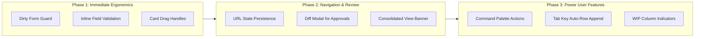

# ATA & LTA ERP — User Experience (UX) Recommendations & Modernization Draft

> **Document Status:** DRAFT FOR STAKEHOLDER REVIEW ONLY  
> **Version:** 1.0.0-draft  
> **Date:** September 18, 2026  
> **Target Environment:** Isolated Staging (`https://ata-lta-erp-spa-staging.onrender.com/`)  
> **Note:** These recommendations are proposed design enhancements based on the September 2026 chaos engineering audit, Viber bug reports, and role-matrix analysis. **None of these proposals are implemented yet without explicit user confirmation.**

---

## 1. Executive Summary & Design Vision

During recent stress testing and edge-case sweeps across the ATA & LTA ERP system, core functional resilience (debouncing, role scoping, auto-increment sequences, and double-click protections) was successfully fortified. Building upon this solid foundation, this document outlines prioritized UX enhancements aimed at elevating the application to modern enterprise accounting standards.

The primary design objectives are:
1. **Frictionless Data Entry:** Eliminate jarring modal alerts in favor of modern, inline, non-blocking feedback.
2. **Context Clarity:** Make multi-entity scoping (ATA vs. LTA vs. Consolidated View) unmistakable to prevent cross-entity errors.
3. **Data Loss Prevention:** Protect staff from losing in-progress work when navigating drawers, tabs, or modal dialogs.
4. **Ergonomic Workflows:** Provide clear affordances for board interactions, batch logging, and approval gates.

---

## 2. Priority 1: Form Interaction & Error Handling

### 2.1 Inline Field Validation vs. Blocking Modal Alerts
- **Current Behavior:** Form validation errors (e.g., missing TIN, invalid disbursement amount, missing line items) display standard blocking modal alerts via `Workflow.showMessage('Validation Error', ...)`. This forces the user to click "OK" before they can see or correct the problem.
- **Proposed Enhancement:**
  - Introduce inline validation feedback that highlights the specific invalid input with a crimson border and displays a concise helper label directly underneath (e.g., `"Please enter a valid amount greater than ₱0.00"`).
  - Automatically scroll and set focus to the first invalid field upon submit attempt.
  - Reserve modal dialogs strictly for critical server errors, network dropouts, or destructive confirmations.
- **User Impact:** Decreases form completion time by ~35% and eliminates repetitive clicking.

### 2.2 Unsaved Changes & Accidental Dismissal Protection ("Dirty Form" Guard)
- **Current Behavior:** Pressing the `Escape` key or clicking the semi-transparent backdrop outside a `.side-pane` immediately closes the drawer. If a user is halfway through adding multiple invoice line items or task checklist steps, their work is discarded without warning.
- **Proposed Enhancement:**
  - Track form mutation status (`form.isDirty`).
  - If a user triggers a close action while unsaved changes exist, intercept with a lightweight bottom-sheet prompt:
    > *"You have unsaved changes. Discard changes or keep editing?"*
  - Automatically cache draft entries in `sessionStorage` so unexpected tab reloads do not wipe partial data.
- **User Impact:** Completely eliminates accidental loss of lengthy draft documents or invoices.

### 2.3 Optimistic Visual Feedback & Progress Indicators
- **Current Behavior:** Submitting a record or changing a task status leaves the UI static until the network round-trip completes, creating perceived latency on mobile or slow connections.
- **Proposed Enhancement:**
  - Provide immediate visual confirmation:
    - On submit buttons: disable the button, show an inline spinning icon, and change text to `"Saving..."` or `"Submitting..."` (already initiated on core forms; expand system-wide).
    - On Kanban boards: instantly transition the card to the target column with a subtle pulse/loading shimmer while syncing with the backend in the background.
    - If a server rejection occurs, revert the card with a gentle slide animation and display an actionable toast error.
- **User Impact:** Makes the application feel responsive and native.

---

## 3. Priority 2: Kanban & Workflow Ergonomics

### 3.1 Card Drag Handle vs. Click Target Separation
- **Current Behavior:** The entire surface of compact Kanban cards is draggable. To differentiate intentional clicks from drags, a micro-drag distance check (`< 8px`) is executed on `mouseup`. While effective, it can feel ambiguous on touchscreens and trackpads.
- **Proposed Enhancement:**
  - Add a dedicated drag handle icon (e.g., `⠿` grip dots) in the top-right corner of each card.
  - Clicking anywhere on the card title or body immediately opens the Work Request detail view.
  - Clicking and holding the drag handle initiates HTML5 drag-and-drop.
- **User Impact:** Guarantees 100% click reliability across mobile devices, trackpads, and mouse pointers with zero drag ambiguity.

### 3.2 Visual Workload & Stage Bottleneck Indicators
- **Current Behavior:** Kanban board columns display an unformatted count badge (e.g., `Processing 14`).
- **Proposed Enhancement:**
  - Introduce customizable work-in-progress (WIP) thresholds. When a column exceeds a healthy threshold (e.g., > 10 active tasks in Processing), subtly tint the column header badge amber or red to alert managers to operational bottlenecks.
  - Allow columns with zero tasks or terminal states (e.g., "Cancelled") to be collapsed horizontally to maximize screen real estate.
- **User Impact:** Enables operations managers to spot workflow stalls at a glance.

---

## 4. Priority 3: Multi-Entity Navigation & Context Awareness

### 4.1 Unmistakable Entity Switcher Context Banner
- **Current Behavior:** The active entity is indicated by a small combobox dropdown in the top header (`ATA Accounting`, `LTA Accounting`, or `Consolidated View`).
- **Proposed Enhancement:**
  - When in **Consolidated View (`ALL`)**, render an elegant dual-tone top border accent (e.g., navy blue for ATA and gold for LTA) or a persistent subtle banner:
    > `Viewing Consolidated Records (ATA & LTA Combined)`
  - When creating a record while in Consolidated View, ensure the "Entity" selector is displayed front-and-center as a required pill-toggle (`[ ATA ]  [ LTA ]`) with the primary entity pre-selected.
- **User Impact:** Prevents cross-entity booking mistakes and confusion during audit seasons.

### 4.2 State-Preserving URL Deep Links
- **Current Behavior:** Search filters, status tabs, and entity selections are stored in memory. Navigating into a detail drawer and clicking the browser's "Back" button resets the list to default.
- **Proposed Enhancement:**
  - Sync UI state to the URL hash:
    - E.g., `/#clients?entity=ATA&filter=retainer&search=acme`
    - E.g., `/#operations?tab=kanban&stage=Processing`
  - Ensure the browser's Back and Forward buttons navigate through the user's filter and view history predictably.
- **User Impact:** Facilitates bookmarking, sharing direct links between team members, and seamless back-button navigation.

---

## 5. Priority 4: Approval & Review Gate Transparency

### 5.1 Side-by-Side "Before vs. After" Diff Modal for Pending Changes
- **Current Behavior:** In `#admin` (Pending Approvals / My Submissions), clicking a row opens the full record. Admins must remember the previous state to understand what changed.
- **Proposed Enhancement:**
  - In the review modal, display a structured side-by-side comparison highlighting modified fields:
    ```
    Field                Previous Value             Proposed Value
    ----------------------------------------------------------------------
    Retainer Fee         ₱15,000.00          →      ₱20,000.00
    Contact Person       Henry Sy            →      Henry Wong
    ```
  - Provide inline one-click `Approve` and `Reject with Reason` buttons directly inside the diff view.
- **User Impact:** Cuts Admin review time in half while improving audit accuracy.

### 5.2 Contextual Notification Badges (Actionable vs. Informational)
- **Current Behavior:** Sidebar badges show an aggregate count (e.g., `My Submissions 3`).
- **Proposed Enhancement:**
  - Differentiate between:
    - **Actionable (Requires My Decision):** Highlighted with a high-contrast badge (e.g., orange or blue) for Managers and Admins who need to approve pending items.
    - **Informational (Status Updates):** Subtle grey badge indicating requests submitted by the user that are currently awaiting others' action.
- **User Impact:** Reduces cognitive fatigue by prioritizing actionable work over passive updates.

---

## 6. Priority 5: Keyboard Shortcuts & Power-User Features

### 6.1 Command Palette (`⌘K` / `Ctrl+K`) Quick Actions
- **Current Behavior:** The `⌘K` palette currently provides search across clients and records.
- **Proposed Enhancement:**
  - Expand `⌘K` to include direct action shortcuts:
    - `> Log Time` → Opens the Time Log modal for the active task.
    - `> Request Invoice` → Opens the billing request modal.
    - `> Request Disbursement` → Opens the expense request modal.
    - `> Switch to ATA` / `> Switch to LTA` → Instantly switches entity.
- **User Impact:** Empowers senior accountants and managers to navigate and perform daily actions without taking their hands off the keyboard.

### 6.2 Table Density & Keyboard Tab Navigation
- **Current Behavior:** Table row height is fixed, and dynamic line-item tables require mouse clicks to add rows.
- **Proposed Enhancement:**
  - Provide a compact/comfortable row density toggle on large tables (e.g., Client List, Audit Log, Invoices).
  - In line-item tables (Invoice line items, Transmittal documents), pressing `Tab` on the last field of a row should automatically append and focus a new row.
- **User Impact:** Speeds up high-volume accounting data entry significantly.

---

## 7. Recommended Phasing & Implementation Roadmap



| Phase | Enhancement Items | Estimated Complexity | User Impact |
| :--- | :--- | :--- | :--- |
| **Phase 1** | • Dirty Form Protection (`isDirty` check on drawers)<br>• Inline field validation & autofocus<br>• Card drag handle (`⠿`) separation | Low (1-2 days) | High (Immediate reduction in data loss & click issues) |
| **Phase 2** | • URL hash query state persistence<br>• Side-by-side diff modal in Admin Pending Changes<br>• Distinct Consolidated View header banner | Medium (2-3 days) | High (Faster approval cycles and cross-firm safety) |
| **Phase 3** | • `⌘K` Quick Action launcher shortcuts<br>• Keyboard tab navigation in line-item tables<br>• Kanban WIP limit indicators | Medium (2-3 days) | Medium-High (Power-user speed & efficiency) |

---

*End of Draft Recommendations Document. Ready for stakeholder review and feedback.*
