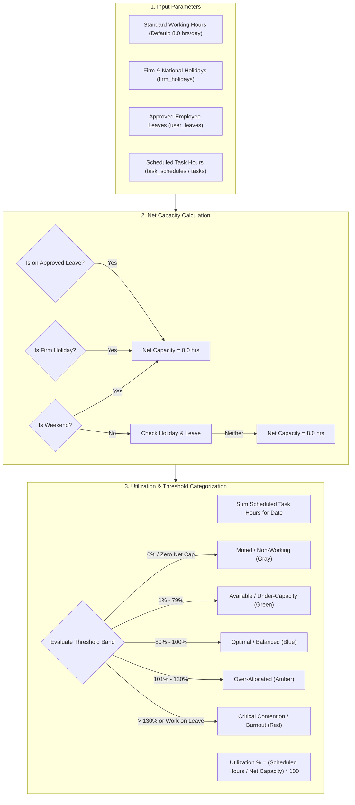
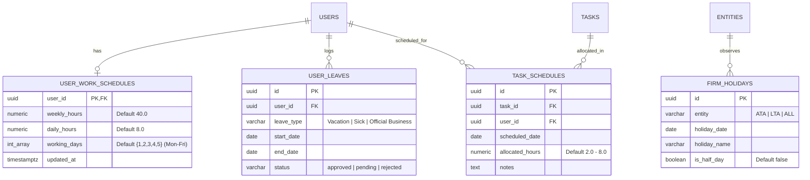
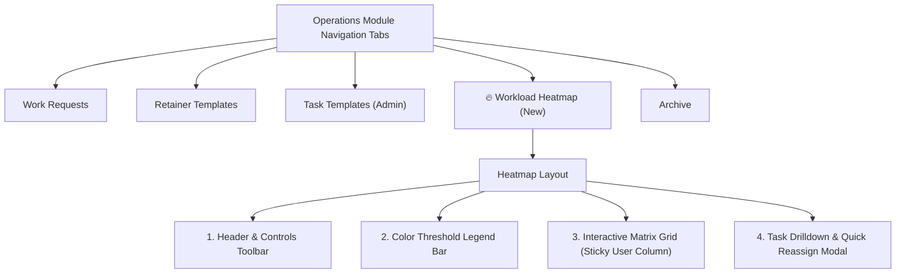
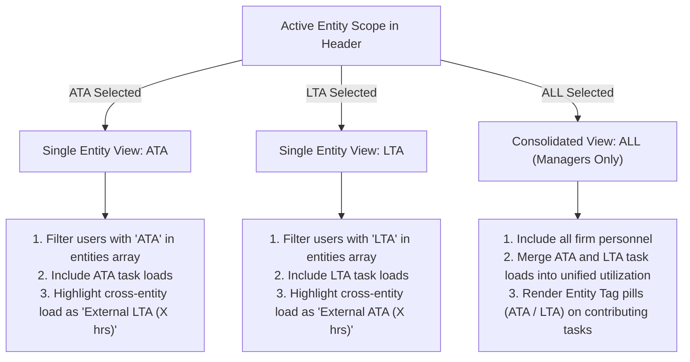
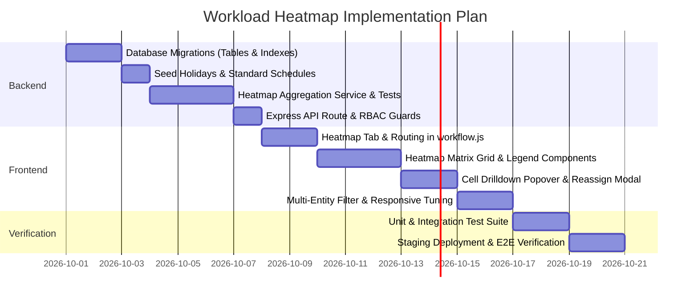

# Technical Specification: Team Workload & Capacity Heatmap Engine

> **Document Identifier:** `DOC-SPEC-WORKLOAD-HEATMAP-2026-V1`  
> **Target Module:** Operations / Workflow Subsystem (`#operations?tab=workload-heatmap`)  
> **Status:** Production-Ready Architectural & Implementation Specification  
> **Scope:** Exclusive to the **Workload Heatmap & Capacity Engine** (All other resource planning features excluded)  
> **Date:** September 2026  

---

## 1. Executive Summary & Purpose

The **Team Workload & Capacity Heatmap Engine** is a dedicated visual analytics and operational dispatching tool engineered specifically for the ATA & LTA ERP platform. 

### Core Problem Solved
Currently, work requests and tasks are assigned without real-time visibility into an employee's existing workload or calendar availability. As a consequence, staff members frequently experience deadline clustering (multiple BIR tax filings or SEC reports due on the exact same date), resulting in operational bottlenecks, unpaid overtime, and heightened risk of statutory compliance penalties.

### Scope of this Specification
This document specifies **strictly and exclusively** the Workload Heatmap feature:
1. **Mathematical Capacity & Utilization Engine** (Day-by-day and weekly aggregations).
2. **Minimal Relational Database Schema** (Schedules, firm holidays, leaves, and task schedules).
3. **Backend RESTful API & Aggregation Service** (`/v1/operations/workload-heatmap`).
4. **Interactive Frontend Heatmap UI** (Notion/Jira-inspired matrix grid, department filtering, color threshold bands, and drilldown popovers).
5. **Multi-Entity Behavior** (ATA, LTA, and Consolidated View rules).

---

## 2. Core Concepts & Calculation Rules



### 2.1 Net Available Capacity Formula
For any given user $u$ on date $d$:

$$\text{NetCapacity}(u, d) = \begin{cases} 
0.0 & \text{if } \text{isWeekend}(d) \\
0.0 & \text{if } \text{isFirmHoliday}(d, \text{user.entity}) \\
0.0 & \text{if } \text{isOnApprovedLeave}(u, d) \\
4.0 & \text{if } \text{isHalfDayHoliday}(d) \\
\text{user.dailyHours} & \text{otherwise (default: 8.0 hrs)}
\end{cases}$$

### 2.2 Scheduled Workload Aggregation
Scheduled hours for user $u$ on date $d$ are derived through a dual-mode resolver:

$$\text{ScheduledHours}(u, d) = \sum_{t \in \text{Tasks}(u, d)} \text{ResolvedTaskHours}(t, d)$$

1. **Explicit Allocation (Primary):** If a record exists in `task_schedules` for task $t$ on date $d$, use `allocated_hours`.
2. **Milestone Date Fallback:** If no explicit daily schedule exists:
   - If task has a `deadline` equal to date $d$, assign default estimated milestone effort (e.g., $4.0\text{ hrs}$ for standard task, or $\text{estimated\_hours}$).
   - If task spans `start_date` to `deadline`, distribute $\text{estimated\_hours} / \text{working\_days\_span}$.

### 2.3 Utilization Threshold Bands

| Band Name | Utilization Range | Background Visual | Status Semantic | Manager Action |
| :--- | :---: | :--- | :--- | :--- |
| **Non-Working / Zero** | $0\%$ | Muted Gray (`#F3F4F6`) or Hatched | Weekend, Holiday, Approved Leave, or Zero Load | None required. |
| **Available** | $1\% - 79\%$ | Soft Emerald Green (`#DCFCE7` / `#166534`) | Available capacity. | Prime candidate for new task dispatch. |
| **Optimal** | $80\% - 100\%$ | Soft Sky Blue (`#E0F2FE` / `#075985`) | Balanced, healthy full workload. | Normal tracking; maintain schedule. |
| **Over-Allocated** | $101\% - 130\%$ | Warning Amber (`#FEF3C7` / `#92400E`) | High workload; milestone slippage risk. | Monitor progress; prepare backup co-assignee. |
| **Critical / Conflict** | $> 130\%$ or Work on Leave | Crimson Red (`#FEE2E2` / `#991B1B`) | Severe burnout risk or work assigned while away. | Immediate leveling required (reassign task). |

---

## 3. Database Schema Specifications

The heatmap engine requires only **four minimal, high-performance tables** with zero extraneous dependencies.



### 3.1 DDL Migration Script (`migrations/000050_create_workload_heatmap_tables.js`)

```sql
-- 1. User Work Schedules (Standard daily capacity)
CREATE TABLE IF NOT EXISTS user_work_schedules (
  user_id UUID PRIMARY KEY REFERENCES users(id) ON DELETE CASCADE,
  weekly_hours NUMERIC(4,2) NOT NULL DEFAULT 40.00,
  daily_hours NUMERIC(4,2) NOT NULL DEFAULT 8.00,
  working_days INT[] NOT NULL DEFAULT '{1,2,3,4,5}', -- 1=Mon, 5=Fri
  created_at TIMESTAMPTZ NOT NULL DEFAULT NOW(),
  updated_at TIMESTAMPTZ NOT NULL DEFAULT NOW()
);

-- 2. Firm & Statutory Holidays
CREATE TABLE IF NOT EXISTS firm_holidays (
  id UUID PRIMARY KEY DEFAULT gen_random_uuid(),
  entity VARCHAR(10) NOT NULL CHECK (entity IN ('ATA', 'LTA', 'ALL')),
  holiday_date DATE NOT NULL,
  holiday_name VARCHAR(150) NOT NULL,
  is_half_day BOOLEAN NOT NULL DEFAULT FALSE,
  created_at TIMESTAMPTZ NOT NULL DEFAULT NOW(),
  UNIQUE(entity, holiday_date)
);

CREATE INDEX IF NOT EXISTS idx_firm_holidays_date ON firm_holidays(holiday_date);

-- 3. Employee Approved Leaves (PTO)
CREATE TABLE IF NOT EXISTS user_leaves (
  id UUID PRIMARY KEY DEFAULT gen_random_uuid(),
  user_id UUID NOT NULL REFERENCES users(id) ON DELETE CASCADE,
  leave_type VARCHAR(50) NOT NULL CHECK (leave_type IN ('Vacation', 'Sick', 'Official Business', 'Emergency', 'Study')),
  start_date DATE NOT NULL,
  end_date DATE NOT NULL,
  status VARCHAR(20) NOT NULL DEFAULT 'approved' CHECK (status IN ('pending', 'approved', 'rejected')),
  notes TEXT,
  created_at TIMESTAMPTZ NOT NULL DEFAULT NOW()
);

CREATE INDEX IF NOT EXISTS idx_user_leaves_lookup ON user_leaves(user_id, start_date, end_date) WHERE status = 'approved';

-- 4. Explicit Daily Task Schedules
CREATE TABLE IF NOT EXISTS task_schedules (
  id UUID PRIMARY KEY DEFAULT gen_random_uuid(),
  task_id UUID NOT NULL REFERENCES tasks(id) ON DELETE CASCADE,
  user_id UUID NOT NULL REFERENCES users(id) ON DELETE CASCADE,
  scheduled_date DATE NOT NULL,
  allocated_hours NUMERIC(4,2) NOT NULL DEFAULT 4.00,
  notes TEXT,
  created_at TIMESTAMPTZ NOT NULL DEFAULT NOW(),
  updated_at TIMESTAMPTZ NOT NULL DEFAULT NOW(),
  UNIQUE(task_id, user_id, scheduled_date)
);

CREATE INDEX IF NOT EXISTS idx_task_schedules_user_date ON task_schedules(user_id, scheduled_date);
CREATE INDEX IF NOT EXISTS idx_task_schedules_task ON task_schedules(task_id);
```

---

## 4. Backend API & Aggregation Architecture

### 4.1 Route Definition
Mounted under both `/v1/operations` and `/v1/work-requests`:

```javascript
router.get(
  '/workload-heatmap',
  auth,
  entityScope,
  resolveEntity({ allowAll: true }),
  requirePermission('workflow:view'),
  operationsController.getWorkloadHeatmap
);
```

### 4.2 Query Parameters & Contract
- `startDate` (ISO `YYYY-MM-DD`, mandatory) — Window start.
- `endDate` (ISO `YYYY-MM-DD`, mandatory) — Window end (max window: 60 days).
- `department` (optional) — Filter by `Operations`, `Accounting`, `Documentation`, `HR`.
- `viewMode` (optional, default `day`) — `day` (daily matrix) or `week` (7-day grouped buckets).

### 4.3 JSON Response Schema (`GET /v1/operations/workload-heatmap`)

```json
{
  "meta": {
    "entity": "ATA",
    "startDate": "2026-10-01",
    "endDate": "2026-10-14",
    "viewMode": "day",
    "totalUsers": 12,
    "firmAverageUtilization": 84
  },
  "days": [
    {
      "date": "2026-10-01",
      "dayName": "Thu",
      "isWeekend": false,
      "isHoliday": false,
      "holidayName": null
    }
  ],
  "users": [
    {
      "userId": "9b1deb4d-3b7d-4bad-9bdd-2b0d7b3dcb6d",
      "name": "Maria Santos",
      "email": "maria@ata-lta.ph",
      "role": "Operations",
      "department": "Operations",
      "summary": {
        "totalNetCapacity": 80.0,
        "totalScheduledHours": 74.0,
        "averageUtilizationPct": 93,
        "status": "OPTIMAL"
      },
      "schedule": [
        {
          "date": "2026-10-01",
          "netCapacity": 8.0,
          "scheduledHours": 6.5,
          "utilizationPct": 81,
          "status": "OPTIMAL",
          "isHoliday": false,
          "isLeave": false,
          "tasks": [
            {
              "taskId": "f1234567-0000-0000-0000-000000000001",
              "workRequestId": "a1234567-0000-0000-0000-000000000001",
              "workRequestTitle": "Makati Mayor's Permit Renewal 2026",
              "clientName": "Ayala Tech Ventures Inc.",
              "taskTitle": "LGU Assessment & Tax Clearance",
              "allocatedHours": 4.5,
              "taskStatus": "In Progress",
              "requiredLinkType": "disbursement"
            },
            {
              "taskId": "f1234567-0000-0000-0000-000000000002",
              "workRequestId": "a1234567-0000-0000-0000-000000000002",
              "workRequestTitle": "SEC Monthly Document Compliance",
              "clientName": "San Miguel Holdings",
              "taskTitle": "Document Verification",
              "allocatedHours": 2.0,
              "taskStatus": "To Do",
              "requiredLinkType": null
            }
          ]
        }
      ]
    }
  ]
}
```

---

## 5. Frontend UI/UX Specification

The Heatmap is mounted in the **Operations module** under the dedicated tab:  
`#operations?tab=workload-heatmap`



### 5.1 Controls & Navigation Toolbar
```
[ < Prev ] [ Today ] [ Next > ]   October 1 – October 14, 2026   [ Daily | Weekly ]
Departments: [ All (18) ] [ Operations (8) ] [ Accounting (4) ] [ Documentation (3) ] [ HR (3) ]
Entity Scope: [ ATA Accounting ] ⌄
```

- **Date Paging:** Step backward or forward by the current window duration (e.g., $\pm 14\text{ days}$).
- **"Today" Button:** Snaps view window immediately to current date.
- **Department Filter Pills:** Instant filtering with live user counts in badge.
- **Granularity Switcher:** Toggles between individual day columns and 7-day aggregated week buckets.

### 5.2 Heatmap Matrix Grid Layout

```
┌─────────────────────────┬──────────┬──────────┬──────────┬──────────┬──────────┐
│ Team Member (Role)      │ Thu Oct 1│ Fri Oct 2│ Sat Oct 3│ Sun Oct 4│ Mon Oct 5│
├─────────────────────────┼──────────┼──────────┼──────────┼──────────┼──────────┤
│ 👤 Maria Santos (Ops)   │  81% 🔵  │  112% 🟠 │  0% ░░░  │  0% ░░░  │  62% 🟢  │
│    80h cap | 93% avg    │  6.5/8h  │  9.0/8h  │  Weekend │  Weekend │  5.0/8h  │
├─────────────────────────┼──────────┼──────────┼──────────┼──────────┼──────────┤
│ 👤 Juan Reyes (Ops)     │  140% 🔴 │  90% 🔵  │  0% ░░░  │  0% ░░░  │  0% 🌴   │
│    72h cap | 108% avg   │ 11.2/8h  │  7.2/8h  │  Weekend │  Weekend │ Vacation │
├─────────────────────────┼──────────┼──────────┼──────────┼──────────┼──────────┤
│ 👤 Ana Lim (Accts)      │  75% 🟢  │  88% 🔵  │  0% ░░░  │  0% ░░░  │  100% 🔵 │
│    80h cap | 84% avg    │  6.0/8h  │  7.0/8h  │  Weekend │  Weekend │  8.0/8h  │
└─────────────────────────┴──────────┴──────────┴──────────┴──────────┴──────────┘
```

### 5.3 Interactive Cell Drilldown Popover
Clicking any cell opens a focused slide-out popover:

```
┌──────────────────────────────────────────────────────────┐
│ 📅 Friday, Oct 2, 2026 — Maria Santos                    │
│ Status: Over-Allocated (112% • 9.0 hrs / 8.0 hrs cap)    │
├──────────────────────────────────────────────────────────┤
│ Contributing Tasks (2):                                  │
│                                                          │
│ 1. [WR-ATA-0042] Makati Mayor's Permit Renewal           │
│    Client: Ayala Tech Ventures Inc.                      │
│    Task: LGU Assessment & Tax Clearance                 │
│    Load: 5.0 hrs  •  Status: In Progress                 │
│    [ Open Work Request ↗ ]   [ Reassign Task ⇄ ]         │
│                                                          │
│ 2. [WR-ATA-0055] BIR Quarterly Tax Compliance (2551Q)    │
│    Client: Megaworld Retail Corp.                        │
│    Task: Sales Book Reconciliation                       │
│    Load: 4.0 hrs  •  Status: To Do                       │
│    [ Open Work Request ↗ ]   [ Reassign Task ⇄ ]         │
└──────────────────────────────────────────────────────────┘
```

- **Direct Route Link:** Clicking `[ Open Work Request ↗ ]` opens the Work Request detail view in Side Peek mode without losing Heatmap state.
- **Quick Reassign (`[ Reassign Task ⇄ ]`):** Opens a quick modal listing available teammates with $<80\%$ utilization on that specific date, allowing one-click workload leveling.

---

## 6. Multi-Entity Behavior (ATA, LTA, and Consolidated View)

The heatmap adapts dynamically based on the active entity context selected in the navigation header:



1. **Discrete Entity Scoping (ATA or LTA):**
   - Displays tasks belonging to the active entity.
   - If a dual-entity worker is also executing tasks in the other entity on that day, the heatmap displays their **total true capacity utilization** while masking sensitive client names from the alternate firm, displaying an indicator: *"+2.5 hrs allocated in LTA"*. This guarantees complete client confidentiality while preventing double-booking.
2. **Consolidated View (`ALL`):**
   - Restricted strictly to Managerial users (`Admin`, `Manager`, or `Management` department) with dual-entity grants.
   - Shows the entire firm workforce across both entities with color-coded entity pills (`ATA` in Blue, `LTA` in Purple) on contributing tasks.

---

## 7. Edge Cases & Fault Tolerance

| Edge Case Scenario | System Handling & Guard |
| :--- | :--- |
| **Zero Net Capacity Day (Weekend / Holiday / PTO)** | Division by zero is guarded: if $\text{NetCapacity} = 0$, formula sets utilization to $0\%$. If tasks are improperly scheduled on a non-working day, the cell highlights as **`Critical / Conflict`** with status: `TASK_ON_LEAVE`. |
| **Half-Day National Holidays** | `firm_holidays.is_half_day = true` adjusts net capacity to $4.0\text{ hours}$ instead of $0.0\text{ hours}$. |
| **Timezone & Date Boundary Drifts** | All date exchanges use strict date-only strings (`YYYY-MM-DD`). Avoids UTC-to-local midnight shifting where tasks appear on the previous day. |
| **Un-scheduled Tasks (Missing Daily Allocation)** | Falls back automatically to milestone due date attribution ($4.0\text{ hrs}$ load on `deadline` date), ensuring un-scheduled tasks are still surfaced in the heatmap. |
| **Staff Member with No Schedule Profile** | Falls back to system default: $40.0\text{ hrs/week}$ ($8.0\text{ hrs/day}$, Monday–Friday). No user will crash the calculation engine. |
| **Rapid Task Reassignments** | Backend endpoint updates in $<100\text{ms}$. Frontend leverages optimistic UI rendering or background re-fetch to update heatmap cells immediately upon reassigning a task. |

---

## 8. Step-by-Step Implementation Roadmap



### Milestone 1: Database & Backend Engine (Days 1–5)
1. Run migration `000050_create_workload_heatmap_tables.js`.
2. Seed Philippine statutory non-working holidays for 2026/2027.
3. Implement `computeWorkloadHeatmap()` service in `backend/src/modules/operations/service.js`.
4. Expose `GET /v1/operations/workload-heatmap` with `workflow:view` guard.
5. Author backend integration tests in `backend/tests/integration/workload-heatmap.test.js` verifying net capacity and utilization math.

### Milestone 2: Frontend Heatmap Interface (Days 6–10)
1. Add tab `workload-heatmap` to `Workflow.renderTabs()` in `erp_prototype/js/workflow.js`.
2. Add route handler in `erp_prototype/js/app.js` (`#operations?tab=workload-heatmap`).
3. Build the interactive matrix grid component with CSS Grid / Flexbox and sticky employee headers.
4. Implement department filtering and daily/weekly view toggling.

### Milestone 3: Drilldown & Leveling Interactions (Days 11–13)
1. Build cell click listener opening the task drilldown card.
2. Implement direct deep-linking to Work Requests via Side Peek mode.
3. Implement quick task re-assignment modal to balance over-allocated workers.

### Milestone 4: Staging Testing & Verification (Days 14–15)
1. Execute automated Playwright test suite verifying:
   - Non-admin vs Admin visibility.
   - Weekend/holiday gray masking.
   - Over-allocation amber/red color threshold triggers.
   - Task drilldown popover display.
2. Deploy to Render staging (`https://ata-lta-erp-spa-staging.onrender.com`).
