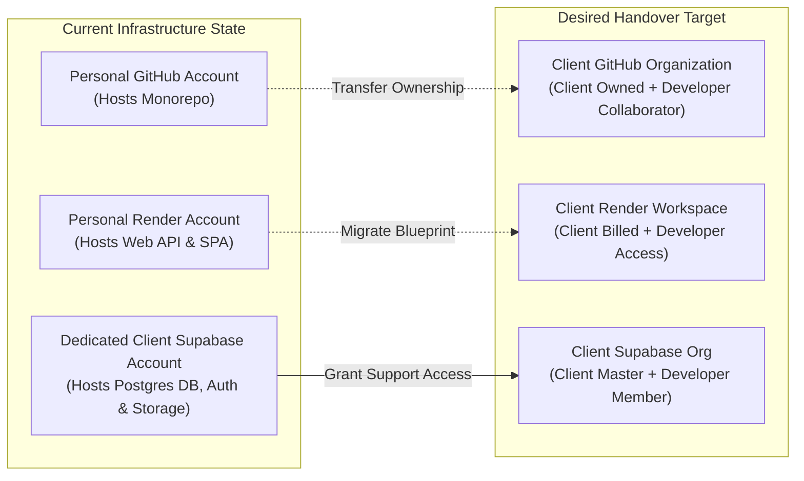

# ASSET TURNOVER & ACCOUNT TRANSFER STRATEGY GUIDE
**Step-by-Step Technical & Operational Playbook for Account Handoff and 3-Month Maintenance Co-Management**

---

| **Document Reference** | `MICROAXIS-ATALTA-ATG-2026-001` |
|:---|:---|
| **Project** | ATA & LTA Accounting Firm ERP System |
| **Service Provider** | MICROAXIS (Project Manager: Mr. Mark Anthony C. Ureta) |
| **Client Organization** | ATA & LTA ACCOUNTING FIRM |
| **Document Purpose** | Strategic Options & Step-by-Step Execution Guide for Transferring Personal GitHub and Render Assets to the Client While Securing 3-Month Warranty Support Access |
| **Target Execution Date**| Post-Settlement / Immediate Handover Window |
| **Maintenance Horizon** | August 28, 2026 – November 28, 2026 (3 Months) |

---

## 1. CONTEXT & STRATEGIC CHALLENGE

During development and staging, several infrastructure components were provisioned using developer personal accounts to accelerate development velocity and facilitate rapid deployment:



### The Three Core Challenges:
1. **GitHub Repository Ownership:** The source code monorepo is currently under a personal developer GitHub account. The Client needs full legal and operational repository ownership, but the development team needs continuous write, branch, and CI/CD access to push bug fixes during the 3-month warranty window (Aug 28 – Nov 28, 2026).
2. **Render Compute Services:** The Web API (Docker service) and Static Site (SPA) are deployed in a personal Render account. The Client needs hosting autonomy and billing control, while the developers need ongoing log inspection, health monitoring, and deploy triggers.
3. **Database & Storage Maintenance:** While the Supabase instance was created specifically for the Client, the developers must maintain active database diagnostic, migration, and performance tuning capabilities without retaining unauthorized personal hold of Client data.

---

## 2. STRATEGIC TURNOVER OPTIONS (COMPARATIVE ANALYSIS)

Below are three structured options to resolve the asset turnover. **Option A is strongly recommended** as it represents enterprise best practice.

---

### OPTION A: GitHub Organization Transfer + Render Team Workspace (RECOMMENDED) ⭐

* **How it Works:** 
  1. The Client creates a free **GitHub Organization** (e.g., `github.com/ata-lta-accounting` or `ata-lta-erp`).
  2. The personal repository is transferred directly to the Client’s Organization.
  3. The development team is added to the repository as **Admin / Write Collaborators** (or via a "Developers" team).
  4. The Client creates a **Render Account / Team Workspace** and connects the repository via `render.yaml` Blueprint, adding the developer as an authorized team member.
  5. The Client adds the developer as a **Member** in the existing dedicated Supabase Project.
* **Pros:**
  * ✅ Full legal and architectural ownership resides immediately with the Client.
  * ✅ Complete preservation of Git commit history, branches (`main`, `uat`), pull requests, and GitHub Actions CI/CD workflows.
  * ✅ Developers maintain zero-friction deployment and debugging access for the 3-month warranty period.
  * ✅ Clean 1-click offboarding on November 28, 2026 (Client simply removes developer member access).
  * ✅ Zero disruption to production URLs or database records.
* **Cons:** Requires a 15-minute coordinated onboarding call with the Client's designated IT administrator.

---

### OPTION B: Repository Mirroring (Clean Fork / Push) to Client Account

* **How it Works:**
  1. The Client creates a brand-new repository under their personal or organization GitHub account.
  2. The developer adds the new repository as a remote (`git remote add client <url>`) and pushes all branches and tags.
  3. Developer sets up fresh Render services under the Client’s Render account.
  4. Developer keeps the original personal repository as an independent development mirror.
* **Pros:**
  * ✅ Developer keeps their personal repo intact as a portfolio/backup archive.
  * ✅ Complete isolation between developer environment and client production.
* **Cons:**
  * ❌ Clunky dual-remote workflow: bug fixes during the 3-month warranty must be pushed to two separate remotes.
  * ❌ Risk of branch divergence between developer copy and client live repository.
  * ❌ Render webhook connections must be manually rebuilt from scratch.

---

### OPTION C: Phased Custody (Co-Ownership during 3-Month Warranty, Full Cutover on Day 90)

* **How it Works:**
  1. The current personal repository and Render deployment remain active during the 3-month warranty support window.
  2. The Client is added as an outside Collaborator / Co-owner to the GitHub repo and Render services.
  3. Master database credentials and daily automated SQL backups (`backup-uat.yml`) are continuously delivered to the Client.
  4. On **November 28, 2026** (end of warranty), a formal final cutover is executed: repository ownership is transferred, Render services are handed over, and developer access is fully terminated.
* **Pros:**
  * ✅ Zero immediate configuration changes needed during the initial launch.
  * ✅ Maximum stability and speed for bug fixes in the immediate post-launch weeks.
* **Cons:**
  * ❌ Leaves core intellectual property technically under developer personal account for 90 days.
  * ❌ Does not fully satisfy immediate asset delivery requirements under strict corporate governance.

---

## 3. STEP-BY-STEP EXECUTION PLAYBOOK (OPTION A)

Follow this step-by-step procedure to execute the complete turnover safely without downtime.

---

### PHASE 1: Pre-Transfer Backups & Security Baseline

Before modifying any repository or hosting settings, take complete offline snapshots:

1. **Full Database Snapshot (Supabase PostgreSQL):**
   * Run a direct logical backup via `pg_dump`:
     ```bash
     pg_dump -h [aws-0-region.pooler.supabase.com] -p 6543 -U postgres.[project-ref] -d postgres -F c -b -v -f ata_lta_erp_full_backup_$(date +%Y%m%d).dump
     ```
   * Download the latest automated backup artifact from GitHub Actions (`backup-uat.yml`).
2. **Full Git Repository Bundle Backup:**
   * Create an all-inclusive Git bundle containing all branches, tags, and commits:
     ```bash
     cd /home/javvii/FreelanceProject/Project4_Final-Render
     git bundle create ../ata-lta-erp-complete-backup.bundle --all
     ```
3. **Document Master Secrets Inventory:**
   * Prepare a secure, encrypted one-time vault (e.g. 1Password, Bitwarden, or encrypted zip) containing:
     * Supabase Project URL, Database URL (Pooler & Direct), Service Role Key, Anon Key.
     * Supabase Storage Bucket Names & Policy Definitions.
     * Render Environment Variables (`NODE_ENV`, `PORT`, `CORS_ORIGIN`, `SUPABASE_URL`, `SUPABASE_SERVICE_ROLE_KEY`).

---

### PHASE 2: GitHub Repository Ownership Transfer

1. **Client Setup (Client Action):**
   * Client creates a GitHub Organization (e.g., `https://github.com/organizations/new` -> Select "Free").
   * Organization Name suggestion: `ata-lta-accounting` or `ata-lta-firm`.
   * Client invites developer's GitHub username as an Organization member.
2. **Initiate Repository Transfer (Developer Action):**
   * In the current repository on GitHub (`jevvii/ata-lta-erp-final-render`):
     * Navigate to **Settings** -> Scroll to bottom **Danger Zone** -> Click **Transfer ownership**.
     * Enter the Client's new Organization name (or Client GitHub username).
     * Type the repository name to confirm and click **Transfer**.
3. **Accept Transfer (Client Action):**
   * The Client Organization Owner receives an email notification or banner in GitHub Organization Settings -> **Repositories** -> **Pending transfers**.
   * Click **Accept Transfer**.
   * *(Note: GitHub automatically redirects all previous clone/push URLs to the new location).*
4. **Configure 3-Month Developer Access (Client Action):**
   * In the transferred repository: Navigate to **Settings** -> **Collaborators and teams**.
   * Add developer's GitHub account with **Admin** or **Write** permissions.
   * Verify developer can view repository, push to `main`/`uat`, and view GitHub Actions workflows.
5. **Update Local Git Remotes (Developer Action):**
   * Update the local repository remote URL:
     ```bash
     git remote set-url origin git@github.com:ata-lta-accounting/ata-lta-erp-final-render.git
     git fetch origin
     git status
     ```

---

### PHASE 3: Supabase Access Co-Management

Since the Supabase project is already a dedicated instance created for the Client:

1. **Verify Client Master Ownership (Client Action):**
   * Ensure the project is registered under the Client’s corporate email address (`admin@ata-lta.ph` or managing partner's email).
2. **Grant Developer Support Access (Client Action):**
   * In Supabase Dashboard -> Select Project (`ata-lta-erp-uat` / `ata-lta-erp-prod`).
   * Navigate to **Project Settings** -> **Members** -> Click **Invite Member**.
   * Enter developer email: `simplekramateru14@gmail.com`.
   * Assign Role: **Administrator** (or **Developer** with Database & Storage management rights).
3. **Validate Maintenance Capabilities (Developer Action):**
   * Verify ability to access SQL Editor, run migration scripts, monitor database performance metrics, inspect storage buckets, and view API logs.

---

### PHASE 4: Render Deployment Migration & Service Ownership

To move Render hosting out of developer personal billing and into Client ownership:

1. **Client Render Setup (Client Action):**
   * Client registers a Render account at `https://render.com` using corporate credentials (`admin@ata-lta.ph`).
   * Client creates a Team Workspace (e.g. `ATA-LTA-Accounting`).
   * In **Team Settings** -> **Members**, invite developer email (`simplekramateru14@gmail.com`) with **Admin / Collaborator** role.
2. **Connect Transferred GitHub Repository (Client / Developer Action):**
   * In the Client's Render Dashboard, click **New +** -> **Blueprint**.
   * Connect the transferred GitHub repository (`ata-lta-accounting/ata-lta-erp-final-render`).
   * Select branch: `uat` (or `main` for production).
3. **Configure Environment Secrets:**
   * Render will detect `render.yaml` and prompt for the environment group secrets (`erp-uat-secrets`):
     * `SUPABASE_URL`
     * `SUPABASE_SERVICE_ROLE_KEY`
     * `SUPABASE_ANON_KEY`
     * `DATABASE_URL`
     * `CORS_ORIGIN`
   * Populate these from the Master Secrets Inventory.
4. **Deploy & Validate Services:**
   * Trigger initial blueprint deployment on Render.
   * Verify both services are active:
     * `ata-lta-erp-api` (Docker Web Service) -> Verify `/health` returns `200 OK`.
     * `ata-lta-erp-spa` (Static Site Frontend) -> Verify login, navigation, and API communication.
5. **Decommission Developer Personal Render Services:**
   * Once Client Render services are verified live, suspend and delete the old test services under developer personal account to avoid confusion and duplicate hosting costs.

---

### PHASE 5: Post-Transfer Verification & Smoke Testing Checklist

Run this quick validation checklist immediately following the migration:

- [ ] **Git Push / Pull Verification:** Developer successfully pushes a test commit to `uat` branch on the new repository.
- [ ] **CI/CD Pipeline Execution:** GitHub Actions CI workflow triggers, passes all 18 test suites (154 tests), and completes dry-run migrations.
- [ ] **Render Auto-Deployment:** Render automatically deploys the updated commit from GitHub.
- [ ] **Frontend SPA Login:** Log in as `admin@ata-lta.ph` and `ops-ata@ata-lta.ph` on the live Render URL.
- [ ] **Database & Storage Connectivity:** Upload a sample document in DMS and verify it is stored in Supabase Storage with functional signed download URLs.
- [ ] **Nightly Automated Backup:** Run a manual trigger of `.github/workflows/backup-uat.yml` to confirm database dump uploads successfully to GitHub Artifacts / Storage.

---

## 6. DAY-90 OFFBOARDING PROTOCOL (NOVEMBER 28, 2026)

On November 28, 2026, upon the successful conclusion of the 3-Month Free Warranty and Maintenance Support period:

1. **Supabase Offboarding:**
   * Client navigates to Supabase **Project Settings** -> **Members** -> Removes `simplekramateru14@gmail.com`.
2. **Render Offboarding:**
   * Client navigates to Render **Team Settings** -> **Members** -> Removes developer collaborator account.
3. **GitHub Offboarding:**
   * Client navigates to GitHub **Settings** -> **Collaborators** -> Removes developer write access (or retains read-only if mutually agreed for reference).
4. **Final Security Baseline (Secret Rotation):**
   * Follow [`docs/runbooks/SECRET_ROTATION.md`](file:///home/javvii/FreelanceProject/Project4_Final-Render/docs/runbooks/SECRET_ROTATION.md) to rotate:
     * Supabase Database Password
     * Supabase Service Role Key & JWT Secret
     * Render Deploy Hooks and API Tokens
5. **Final Transition Certificate:** Both Parties sign an administrative completion note archiving the 3-month support engagement.

---

## 7. RECOMMENDATION & NEXT ACTIONS

1. **Review this Strategy Guide:** Confirm that **Option A** fits the operational preferences of both MICROAXIS and ATA & LTA Accounting Firm.
2. **Schedule a 20-Minute Transfer Session:** Set a brief coordination call with the Client's primary IT contact to create the GitHub Organization and Render Team.
3. **Execute Phases 1 through 5:** Complete repository transfer, Render blueprint sync, and Supabase member invitation within 48–72 hours following sign-off.
4. **Finalize Sign-Off Documentation:** Once Note 3 is executed, the Sign-Off Document's asset delivery records will seamlessly reflect completed infrastructure transfer.

---
*End of Asset Turnover and Account Transfer Strategy Guide — MICROAXIS (2026)*
